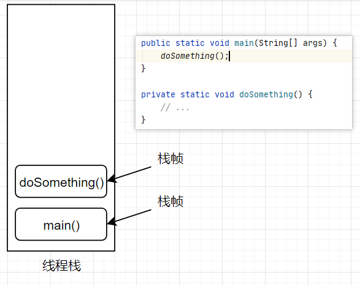

# JVM内存区域

## 概述

提到JVM内存区域一般讲的是JVM的运行时数据区。其一般划分为：

- 程序计数器
- 虚拟机栈
- 本地方法栈
- 堆
- 方法区

## 程序计数器

程序计数器是一块较小的内存区域，他是当前线程所执行的字节码的**行号指示器**。每个线程都有一个独立的程序计数器，各个计数器之间互不影响。程序计数器是**线程私有**的。

## 虚拟机栈

虚拟机栈中存放的是方法执行过程中的数据。当JVM启动一个线程时，会为其分配一个独立的栈空间。每调用一个方法都会在栈中创建一个栈帧。

栈帧中用于存放当前执行方法的局部变量表、操作数栈、动态链接、方法出口等信息。

- **局部变量表** - 存放方法参数和方法内部定义的局部变量
- **操作数栈** - 可以理解为计算过程中的工作空间，比如int a = 1; int b = 2; 计算a + b时需要将1和2分别压入操作数栈，然后对顶部的1和2做加法运算
- **动态链接** - 执行方法区中所需调用方法的符号引用
- **方法出口** - 方法的退出有两种方式，一种是正常退出，其存放上层方法中调用该方法的下一条指令地址；而异常退出时，不会保存这个东西。

## 本地方法栈

本地方法栈的作用与虚拟机类似，其是为Native方法服务的。

## 堆

Java堆是JVM运行时数据区中划分最大的一块区域，其是所有**线程共享**的区域。这块内存用于存放对象的实例。

堆内存细分为*新生代（Young Generation）*和*老年代（Old Generation或Tenured Generation）*。新创建的对象会存放于新生代中，而老年代用于存放生命周期较长的对象。新生代与老年代的默认大小比例是1:2，该数值可通过参数`-XX:NewRatio`指定。

新生代中又细分为*edem区*、*from survivor区*、*to survivor区*。其默认大小比例是8:1:1，该数值可通过参数`-XX:SurvivorRatio`指定。新创建的对象会放置于edem区 ，当edem区放满后，执行一次minor GC，将非垃圾对象挪到from survivor区；下次minor GC时，将edem区和from survivor区的非垃圾对象挪到to survivor区；在下次挪回到from survivor区。如此往复，直到新生代均满时，执行一次full GC，将s0和s1中经历数轮minor GC仍存活的对象挪到老年代；

## 方法区

方法区也是线程共享的内存区域。其用于加载的类的信息、常量、静态变量等数据。

