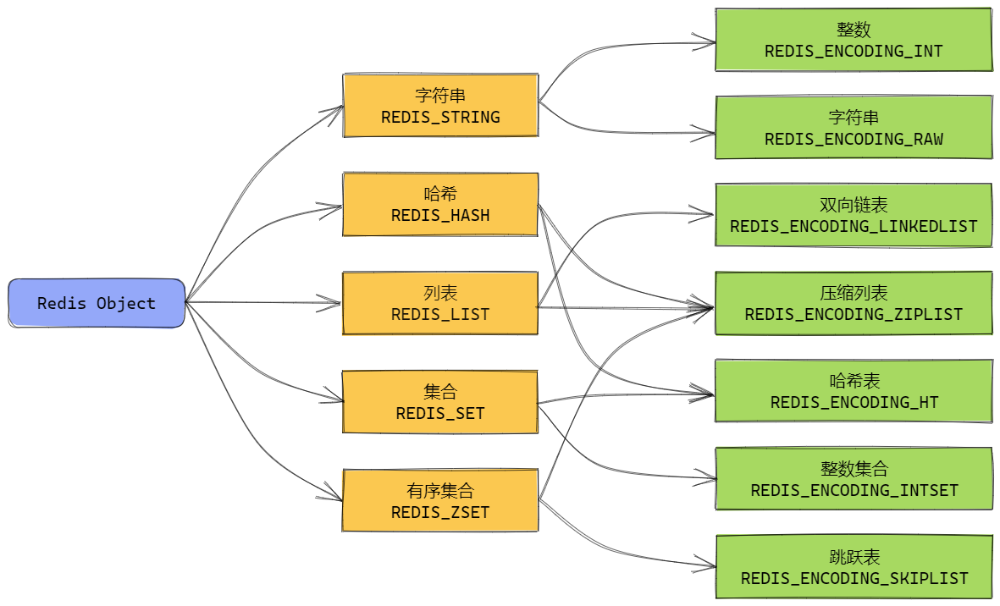
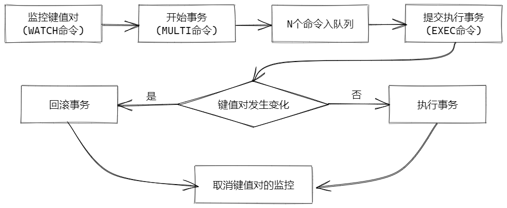
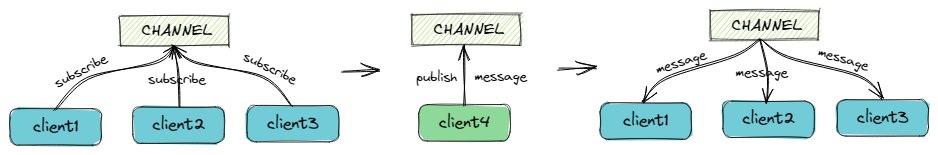
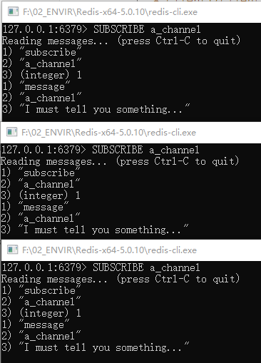

# Redis基础知识

## 1 简介

- 高性能的key-value内存数据库
- 除了简单的key-value类型，还支持list、set、hash等数据结构
- 支持数据持久化，有机制保证内存中的数据写到磁盘中
- 支持集群部署，能够实现高可用

其应用场景包括：

- 缓存“热点”数据
- 计数器
- 限流器
- 发布订阅
- 排行榜
- 分布式锁
- 分布式session
- 队列

## 2 数据结构

### 2.1 字符串（String）

是Redis的最基础的数据结构，基本用法：

```shell
> SET a_key a_value
OK
> GET a_key
"a_value"
```

还有一些其他的常用用法：

- `SETNX key value`：只有在key不存在时，才会设置key的value值
- `STRLEN key`：返回key的value字符串的长度
- `INCR key`：将key中存储的数字+1
- `DECR key`：将key中存储的数字-1

### 2.2 哈希（Hash）

hash结构中，值的结构是多个field -> value，比如：

```shell
> HSET a_key field1 value1
(integer) 1
> HSET a_key field2 value2
(integer) 1
> HGET a_key field1
"value1"
> HGET a_key field1
"value2"
```

如果field已存在，HSET会返回0，但是仍会覆盖已有的field的值：

```shell
> HSET a_key field1 value1
(integer) 1
> HSET a_key field1 value2
(integer) 0
> HGET a_key field1
"value2"
```

其他常见用法有：

- `HDEL key field1 [field2]`： 删除一个或多个field
- `HLEN key`：获取hash中field的数量
- `HSETNX key field value`：只有在field不存在时，才设置field的value值
- `HINCRBY key field increment`：将field中的数字加上increment

### 2.3 列表（List）

list是简单的字符串有序列表，你既可以在头部（left）插入或移除元素，也可以在尾部（right）插入或移除元素。常规用法：

```shell
> RPUSH a_key item1
(integer) 1
> RPUSH a_key item2
(integer) 2
> RPUSH a_key item3
(integer) 3
> LRANGE a_key 0 10
1) "item1"
2) "item2"
3) "item3"
```

其他也有一些常见的用法：

- `LPOP key`：移除并返回头部元素
- `RPOP key`：移除并返回尾部元素

### 2.4 集合（Set）

set类型是String类型的**无序集合**。集合中的成员是唯一的。常见用法：

```shell
> SADD a_key item1
(integer) 1
> SADD a_key item2
(integer) 1
> SADD a_key item2
(integer) 0
> SMEMBERS a_key
1) "item1"
2) "item2"
```

上面的例子中，若集合中不存在元素item1，那么SADD时会返回1，若已存在该元素，则返回0。

集合（Set）的其他常见命令：

- `SDIFF key1 [key2]`：返回第一个集合与其他集合的差异
- `SINTER key1 [key2]`：返回集合的交集
- `SUNION key1 [key2]`：返回集合的并集
- `SREM key member1 [member2]`：移除集合中一个或多个元素

### 2.5 有序集合（Sorted Set）

类似于set，sorted set也是一个String类型的集合，其成员也是唯一的。区别是sorted set的元素会关联一个double类型的值（可以理解为score 分数或是优先级）。redis根据分数将sorted set中的元素从小到大排序。分数允许重复。

```shell
> ZADD a_key 1 item1
(integer) 1
> ZADD a_key 0.5 item2
(integer) 1
> ZADD a_key 2 item2
(integer) 0
> ZADD a_key 0.5 item4
(integer) 1
> ZADD a_key 0.5 item3
(integer) 1
> ZADD a_key 5 item5
(integer) 1
> ZRANGE a_key 0 10 WITHSCORES
 1) "item3"
 2) "0.5"
 3) "item4"
 4) "0.5"
 5) "item1"
 6) "1"
 7) "item2"
 8) "2"
 9) "item5"
10) "5"
> ZRANGE a_key 0 10
1) "item3"
2) "item4"
3) "item1"
4) "item2"
5) "item5"
```

根据观察例子中`ZRANGE`的结果，可以总结出：

1. 集合中已存在的item，再次`ZADD`时，会返回0，**但是score会更新成功**。
2. 相同分数（score）的多个item，返回时是乱序的。
3. `ZRANGE`后面带上`WITHSCORES`时，会将分数也返回。

其他一些sorted set的用法：

- `ZCOUNT key min max`：返回有序集合指定分数区间的元素数量
- `ZREM key member [member ...]`：移除有序集合中一个或多个元素
- `ZREVRANGEBYSCORE key max min [WITHSCORES]`：返回有序集中指定分数区间内的元素，分数从高到低排序

*参考：[Redis 教程](https://www.runoob.com/redis/redis-tutorial.html)*

## 3 数据结构的底层



*参考：[Redis是什么？看这一篇就够了](https://www.cnblogs.com/powertoolsteam/p/redis.html)*

## 4 键（Key）

redis的数据操作都是基于键的，键相关的基本命令有：

- `DEL key`：key存在时，删除key
- `EXISTS key`：检查key是否存在。存在返回1，不存在返回0
- `EXPIRE key seconds`：给key设置过期时间，单位是秒
- `PEXPIRE key milliseconds`：给key设置过期时间，单位是毫秒
- `EXPIREAT key timestamp`：给key设置一个过期时间点，这个时间点参数是[UNIX时间戳](https://baike.baidu.com/item/unix%E6%97%B6%E9%97%B4%E6%88%B3/2078227)，精度是秒
- `PEXPIREAT key milliseconds-timestamp`：同EXPIREAT ，精度是毫秒
- `TTL key`：返回key的剩余生存时间，单位是秒
- `PTTL key`：返回key的剩余生存时间，单位是毫秒
- `RENAME key1 key2`：修改key的名称，将key1改为key2。当key1不存在时，报错；当key2已存在时，修改成功后，原key2的值会被覆盖掉


## 5 事务

### 5.1 事务操作——`MULTI`&`EXEC`组合

Redis的每一个操作都是原子的，每个操作无非是成功或是失败。若想多个操作实现原子，Redis也提供了事务来支持。

Redis事务可以一次执行多个命令，它以`MULTI`命令开始，以`EXEC`命令结束触发执行。两条执行中间的n个命令，被放入队列中，在事务提交后一并执行。

示例：

```shell
> MULTI
OK
> SET a_key value
QUEUED
> GET a_key
QUEUED
> SADD a_key item1 item2
QUEUED
> SMEMBERS a_key
QUEUED
> INCR count_key
QUEUED
> INCR count_key
QUEUED
> GET a_key
QUEUED
> EXEC
1) OK
2) "value"
3) (error) WRONGTYPE Operation against a key holding the wrong kind of value
4) (error) WRONGTYPE Operation against a key holding the wrong kind of value
5) (integer) 1
6) (integer) 2
7) "value"
```

需要注意的是，Redis的事务更多的像是一个”打包“的概念，其与关系型数据库的事务有着本质的区别。**在一个事务中，如果有指令执行失败，它不会打断整个事务并回滚，失败之前与之后的指令都会正常地执行。**（看上面例子中的第3、4条指令是失败的指令）

### 5.2 事务的回滚——`WATCH`机制

有一个例外可以控制事务的回滚——`WATCH`命令，`WATCH`命令在`MULTI`命令前提交，其作用是监视一个key的值，若在`EXEC`时，该key的值发生了变更，那么整个事务的内容都不会被提交（回滚）。我们来做个例子，开启两个Redis客户端client1、client2。

在client1中我们键入：

```shell
# client1
> SET key value1
OK
> WATCH key
OK
> MULTI
OK
> GET key
QUEUED
> SET key value2
QUEUED
```

注意此时我们还未执行`EXEC`，我们在client2中键入：

```shell
# client2
> GET key
"value1"
> SET key value3
OK
> GET key
"value3"
```

再回到client1中执行`EXEC`：

```shell
# client1
> EXEC
(nil)
> GET key
"value3"
```

`EXEC`的返回是*(nil)*，key的值是client2中设置的*"value3"*。

我们总结一下`WATCH`机制的流程：



*无论事务是否回滚，Redis 都会去`UNWATCH`事务前的 `WATCH`命令。*

是不是感觉流程有点熟悉？与前面学习线程与锁里的CAS很像？思想是一样的，“比较”（对比键值对变化）与“交换”（未变则执行，否则回滚）。`WATCH`机制还与Java中的CAS不同的是，`WATCH`并不会引起ABA问题，我们来做个实验：

启动3个客户端，在client1中键入：

```shell
# client1
> SET key value1
OK
> WATCH key
OK
> MULTI
OK
> GET key
QUEUED
> SET key value2
QUEUED
```

在client2中键入：

```shell
# client2
127.0.0.1:6379> GET key
"value1"
127.0.0.1:6379> SET key value3
OK
127.0.0.1:6379> GET key
"value3"
```

在client3中键入：

```shell
# client3
127.0.0.1:6379> GET key
"value3"
127.0.0.1:6379> SET key value1
OK
127.0.0.1:6379> GET key
"value1"
```

回到client1中继续执行：

```shell
# cilent1
127.0.0.1:6379> EXEC
(nil)
> GET key
"value1"
```

我们可以看到`EXEC`的结果依旧是*(nil)*失败，ABA在这里不存在。

## 6 发布订阅模型

Redis的发布订阅模式是一种“一对多”的消息通信模式。多个客户端订阅（subscribe）一个频道（channel），一个客户端向该频道发布（publish）消息，所有订阅该频道的客户端都会收到该消息。



我们来实验一下，开启4个客户端：

client1、client2、client3中分别订阅频道“*a_channel*”：

```shell
# client1/client2/client3
> SUBSCRIBE a_channel
Reading messages... (press Ctrl-C to quit)
1) "subscribe"
2) "a_channel"
3) (integer) 1

```

在client4中向该频道发布消息：

```shell
# client4
> PUBLISH a_channel "I must tell you something..."
(integer) 3
```

在client1、client2、client3中我们会分别收到：

```shell
# client1/client2/client3
1) "message"
2) "a_channel"
3) "I must tell you something..."
```



发布订阅命令相关的命令有：

- `PUBLISH channel message`：将信息发送到指定的频道。
- `SUBSCRIBE channel [channel ...]`：订阅一个或多个频道。
- `UNSUBSCRIBE [channel [channel ...]]`：指退订指定的频道。
- `PUBSUB subcommand [argument [argument ...]]`：查看订阅与发布系统状态。
- `PSUBSCRIBE pattern [pattern ...]`：订阅一个或多个符合给定模式的频道。
- `PUNSUBSCRIBE [pattern [pattern ...]]`：退订所有给定模式的频道。

