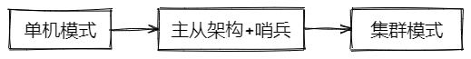

# Redis部署架构

*参考：[如何保证 Redis 高并发、高可用？ ](https://doocs.gitee.io/advanced-java/#/./docs/high-concurrency/how-to-ensure-high-concurrency-and-high-availability-of-redis)*

Redis单机能不能用？当然可以，架构的演进都是从单节点、小规模开始的。如果你的应用刚起步，用户不多，并发一般般，引入redis做做访问优化，单机完全够用。

等你做大做强了，就要渐渐考虑单机redis的问题，就一台机器挂了怎么办？这台机器的内存快满了怎么办？一台机器的并发渐渐扛不住了怎么办？

怎么办，加机器呗。并发抗不住？加一台机器做**一主一从**架构，读写分离，从节点只服务于读请求，还可以继续加机器做**一主多从**，支撑更高的读并发。容量不够用？水平扩容！**多主多从**，用jedis做客户端分片，再引入**哨兵**保证高可用（基于哨兵的高可用集群）。规模再扩大的话使用Redis的**集群模式**（服务端分片，集成了主从复制与哨兵）。

## 1 主从架构

主从架构的意义是通过读写分离来降低单节点的压力。主从架构中的主承担写请求，从节点承担读请求，基于redis的主从复制机制将主节点的数据同步至从节点。

### 1.1 主从复制

[Replication – Redis](https://redis.io/topics/replication)

主从复制机制（master slave replication）是Redis主从架构的核心。 通过简单配置即可指定节点的主从角色及复制关系（*leader-follower*或称*master-slave*），从实例将是主实例的“精确副本”。当链接断开时，从实例都会自动重连主实例，而且无论主实例发生什么事，从实例都会将主实例的状态精确地复制过来（即使主实例宕机重启且没设置备份导致数据集空了，从实例也会将空数据集复制过来）。

简单描述一下这机制：

- 当主从实例构建了有效的连接，主实例会将其数据集的变更，源源不断以“流”的方式发送指令给从实例，这些指令包括：客户端的写指令、key的过期与淘汰等。
- 当主从断连（网络问题或是感知到超时），从节点会尝试重连主节点，如果连接成功，从节点会执行一个“部分重新同步”（partial resynchronization），只去同步断连期间丢失的这部分“指令流”。
- 如果“部分重新同步”搞不定了，从节点将会执行一次全量同步，这就需要获取主节点的RDB文件，通过RDB文件重构完从节点的数据集后，才继续通过“指令流”的方式来保持主从数据的同步（复制）。

现实中使用最多的一种模式，同时也是Redis默认的复制模式：异步复制，能够做到低延迟与高性能。

### 1.2 主从复制的一些重点

- Redis使用“异步复制”，从实例会向主实例发送已经处理的数据数量。
- 一个主实例可以拥有多个从实例。
- 从实例也可以拥有从实例（级联结构）。
- 对于主实例来说，复制的过程是非阻塞的。无论从实例是在初始化同步（initial synchronization），还是在部分重同步（partial resynchronization），主实例都能不间断地处理请求。
- 复制过程中，从实例也基本上是非阻塞的。在初始化同步过程中，

## 2 基于哨兵的高可用

## 3 集群模式

