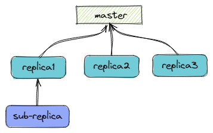
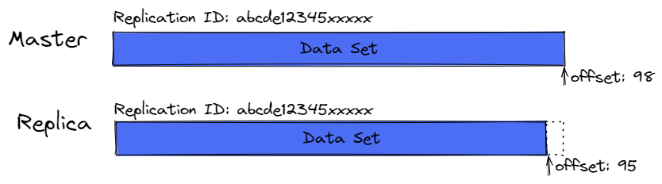

# Redis部署架构

*参考：[如何保证 Redis 高并发、高可用？ ](https://doocs.gitee.io/advanced-java/#/./docs/high-concurrency/how-to-ensure-high-concurrency-and-high-availability-of-redis)*

Redis单机能不能用？当然可以，架构的演进都是从单节点、小规模开始的。如果你的应用刚起步，用户不多，并发一般般，引入redis做做访问优化，单机完全够用。

等你做大做强了，就要渐渐考虑单机redis的问题，就一台机器挂了怎么办？这台机器的内存快满了怎么办？一台机器的并发渐渐扛不住了怎么办？

怎么办，加机器呗。并发抗不住？加一台机器做**一主一从**架构，读写分离，从节点只服务于读请求，还可以继续加机器做**一主多从**，支撑更高的读并发。容量不够用？水平扩容！**多主多从**，用jedis做客户端分片，再引入**哨兵**保证高可用（基于哨兵的高可用集群）。规模再扩大的话使用Redis的**集群模式**（服务端分片，集成了主从复制与哨兵）。


## 1 主从架构

主从架构的意义是通过读写分离来降低单节点的压力。主从架构中的主承担写请求，从节点承担读请求，基于redis的主从复制机制将主节点的数据同步至从节点。

### 1.1 主从复制

整理于：[Replication – Redis](https://redis.io/topics/replication)

主从复制机制（master slave replication）是Redis主从架构的核心。 通过简单配置即可指定节点的主从角色及复制关系（*leader-follower*或称*master-slave*），从实例将是主实例的“精确副本”。当链接断开时，从实例都会自动重连主实例，而且无论主实例发生什么事，从实例都会将主实例的状态精确地复制过来（即使主实例宕机重启且没设置备份导致数据集空了，从实例也会将空数据集复制过来）。

简单描述一下这机制：

- 当主从实例构建了有效的连接，主实例会将其数据集的变更，源源不断以“流”的方式发送指令给从实例，这些指令包括：客户端的写指令、key的过期与淘汰等。
- 当主从断连（网络问题或是感知到超时），从节点会尝试重连主节点，如果连接成功，从节点会执行一个“部分重新同步”（partial resynchronization），只去同步断连期间丢失的这部分“指令流”。
- 如果“部分重新同步”搞不定了，从节点将会执行一次全量同步，这就需要获取主节点的RDB文件，通过RDB文件重构完从节点的数据集后，才继续通过“指令流”的方式来保持主从数据的同步（复制）。

现实中使用最多的一种模式，同时也是Redis默认的复制模式：异步复制，能够做到低延迟与高性能。

### 1.2 主从复制的一些重点

- Redis使用“异步复制”，从实例会向主实例发送已经处理的数据数量。
- 一个主实例可以拥有多个从实例。
- 从实例也可以拥有从实例（级联结构）。
  
- 对于主实例来说，复制的过程是非阻塞的。无论从实例是在初始化同步（initial synchronization），还是在部分重同步（partial resynchronization），主实例都能不间断地处理请求。
- 复制过程中，从实例也**基本上**是非阻塞的。在初始化同步过程中，从实例会先用旧数据集提供查询（这个方式是配置的，否则的话查询请求返回error）。初始化同步结束后，从实例需要删除旧数据集并加载新数据集，在新数据加载完成前是**阻塞**的（大数据集的话可能需要many seconds）。
- 主从复制一般用于可伸缩架构（基于读负载扩容或缩容从节点），也可以用于高可用（如主节点挂了的话从节点还能继续提供读服务）。
- 主实例的自动持久化是可以配置为关闭的，在一些特殊的场景，需要避免主实例的写盘开销，可以将主实例配置为不持久化，同时将从实例开启自动持久化，以保证数据安全。不过这样的话**必须将主实例的自动重启关闭**，否则万一出现主实例宕机，主实例会以空数据集重启，复制会将从实例的数据也给清空。

### 1.3 主从复制的工作原理

主从复制有两个核心概念：

> - **Replication ID**: 一段伪随机的字符串，用于描述一个指定数据集
> - **Replication Offset**: 一个增长的数值，记录复制流的执行进度（偏移量）

这俩概念组合起来就能标识**特定数据集的精确版本**。

当从节点连接至主节点时，从节点会发送[PSYNC](https://redis.io/commands/psync)命令，将当前Replication ID和当前已处理的复制流的offset传给主节点，主节点从offset开始继续向从节点发送复制流（部分重同步partial resynchronization）。但是这种部分复制场景有例外：

1. 主节点中积压的复制流缓冲不能满足从offset开始复制（offset太老了）
2. 从节点请求的Replication ID与当前主节点的Replication ID不一致（主节点有俩ID，均与请求的ID不同时，这个俩ID在后面讲）

出现这俩场景时，主节点将会执行**全量复制**：

执行全量复制时，主节点开启后台进程保存RDB文件，同时开始缓冲客户端发来的写指令。RDB文件生成好后，传输给子节点，子节点利用该RDB文件重构数据集，然后主节点再将缓冲的“写指令流”发送给子节点。如果同时有多个从节点需要全量复制的话，主节点只会生成一个RDB文件，一对多进行全量复制。

在Redis 2.8.0之前，还不支持PSYNC这种部分重同步的指令，那时候有个[SYNC](https://redis.io/commands/sync)指令，从节点发送SYNC后，主节点会将它收到的所有指令批量给从节点发一遍(bulk transfer)。

### 1.4 Replication ID 详解

前面我们提到Replication ID与Offset，

> 如果两个实例的Replication ID与Offset相同，那么这两个实例的数据集一定相同。

这倒好理解，但为什么说一个实例可能会有两个Replication ID呢？

我们启动一个干净的Redis实例，并执行`info replication`：

```shell
127.0.0.1:6379> info replication
# Replication
role:master
connected_slaves:0
master_replid:228dba67579a89e940b478dbe5948b11ea2b653c
master_replid2:0000000000000000000000000000000000000000
master_repl_offset:0
second_repl_offset:-1
repl_backlog_active:0
repl_backlog_size:1048576
repl_backlog_first_byte_offset:0
repl_backlog_histlen:0
```

我们可以看到有两个id `master_replid`与`master_replid2`，同时对应两个offset `master_repl_offset`与`second_repl_offset`，目前有效的只有第一个id与offset。

前面说的，Replication ID描述的是数据集。每个Redis实例在以master身份启动时，或是从replica（从节点）被提升为master（主节点）时，都会生成一个新的Replication ID。从节点在连接上主节点后，并成功握手后，会“**继承**”主节点的Replication ID。这样主从节点都有相同的Replication ID表示它们拥有相同的数据集，只不过可能各自处在不同的时间点（不同的offset）。



但是为什么Redis实例需要2个Replication ID呢？是因为要考虑到**从节点晋升为主节点的情况**。在一次故障转移（failover）发生后，从节点晋升为主节点，将会生成一个新的Replication ID来替换当前`master_replid`（后面称id1），老的Replication ID会被保存到`master_replid2`（后面称id2）上，当前offset不变（offset1），并保存晋升时的offset至`second_repl_offset`（offset2）。当其他从节点连接至新主节点时，它们发送PSYNC带的的Replication ID仍然是老主节点的id（保存在id2上的），主节点会同时与id1、offset1、id2、offset2比较，如果与id2相同且offset差距不大，说明刚发生过故障转移，那么就不需要做全量复制了。

为什么从节点晋升后一定要换一个Replication ID呢？因为故障转移可能存在一种特殊的情况：老主节点仍在线，只是与其他节点产生了网络隔离。这样的话两个主节点都在持续接收写指令，二者的数据集必然是不同的，这就与`如果两个实例的Replication ID与Offset相同，那么这两个实例的数据集一定相同`冲突了。

### 1.5 无磁盘化复制

全量复制依赖于RDB文件的生成，但是如果你的硬盘比较垃圾的话，生成RDB文件就成了一个负担。自Redis 2.8.18开始，提供了一个功能：主节点的后台进程直接将RDB发送给从节点，不走硬盘过一遍。

## 2 基于哨兵的高可用

整理于：[Redis Sentinel Documentation](https://redis.io/topics/sentinel)

哨兵提供了Redis的高可用方案。线上的Redis部署架构，在发生故障时，无需人力干预仍能做到继续提供服务。

Redis哨兵除了提供了高可用的能力外，还有一些其他如监控等功能。从宏观上来看，Redis哨兵能够提供的能力有：

1. **监控**：Sentinel会不断检查主实例和从实例是否在正常工作。
2. **通知**：当监控的实例出问题时，Sentinel能够通过API通知系统管理员，或通知其他应用程序。
3. **自动故障转移**：当监控到主实例出问题时，Sentinel可以将其某个从实例提升为主实例，并自动配置其他从实例连接至新的主实例，同时通知客户端连接至新的地址。
4. **配置提供**：Sentinel可以为客户端提供服务发现能力：客户端只需要配置连接Sentinel，Sentinel就能够为客户端提供指定服务的主实例地址，并在发生故障转移时通知客户端新的主实例地址。

Redis哨兵是一套分布式系统。哨兵本来就是设计为“多个Sentinel协同工作”的机制，这种“协同工作”有如下优点：

1. 多个Sentinel实例同时参与故障检测，降低了误报的风险。（比如某个Sentinel实例监测到master失联，而其他Sentinel实例均未发现异常，那么真实情况可能只是那个Sentinel的网络问题，这样就可以避免发起不必要的故障转移）
2. 部分Sentinel实例故障时，整个Sentinel系统仍能提供服务。（本身就是个提供故障转移能力的系统，却因自身故障而“失能”就没意思了。。）

### 2.1 Sentinel部署前需要了解的

- 一个健壮的架构需要至少3台Sentinel实例。
- 这3台（或更多）Sentinel必须分别独立运行在不同的机器或VM上。
- Sentinel+Redis的架构，不能保证在发生故障时数据100%不丢失（因为Redis的复制是异步的），但是可以通过配置，将丢失的数据控制在一小段时间内。
- Sentinel需要客户端的支持。
- 不经过充分测试的高可用架构是谈不上高可用的，在开发环境中要不时地测试你的架构的“高可用性”，可能的话，生产环境也要做不定期的测试，就像漏电保护开关的“TEST”按钮，你需要每个月按一次以确认它的“漏电保护”功能还在工作。
- 如果在Docker中部署Sentinel或Redis的话，需要额外注意Docker的端口映射问题（Sentinel的自动发现功能是依赖特定端口的）。

### 2.2 Sentinel配置

Sentinel通过`sentinel.conf`配置文件来实现配置的，一个典型的最少的配置如下：

```
sentinel monitor mymaster 127.0.0.1 6379 2
sentinel down-after-milliseconds mymaster 60000
sentinel failover-timeout mymaster 180000
sentinel parallel-syncs mymaster 1

sentinel monitor resque 192.168.1.3 6380 4
sentinel down-after-milliseconds resque 10000
sentinel failover-timeout resque 180000
sentinel parallel-syncs resque 5
```

这个配置监控了两套master，分别指定了名称`mymaster`和`resque`。从实例的信息是不需要手动配置的，它们靠的是自动发现，Sentinel在获取到从实例信息后会自动更新到配置中。当发生故障转移从实例提升为主实例，或是自动发现了新的Sentinel，都会自动重写配置。

`sentinel monitor`配置的用法：

```shell
sentinel monitor <master-group-name> <ip> <port> <quorum>
# sentinel monitor mymaster 127.0.0.1 6379 2
```

这行配置的含义是：让Sentinel监控名为`mymaster`的主实例，其ip是`127.0.0.1`，端口是`6379`，quorum数量是`2`。其他的好理解，这个**quorum**是个啥？

> 当主实例发生失联时，需要至少**quorum**数量的Sentinel均认为该主实例失联，该主实例才会被“确切”认定为失联，然后才会开始故障转移程序。

但是**quorum**只在检测及认定主实例失联时起作用，当确定失联后，仍需要大部分Sentinel（**majority**数量）投票选出一个Sentinel来执行故障转移。比如假设有5台Sentinel，quorum设置为2，那么：

- 同时有2台Sentinel均认为某主实例失联，那么这两台Sentinel中某一台会被选中执行故障转移。
- 如果至少有3台Sentinel能够响应（选举），那么那台Sentinel将会被授权并开始执行故障转移。

*这意味着在故障发生期间，如果大部分的Sentinel无法通信，那么将不会发生故障转移。*

还有两个需要关注的重要的配置：

- `down-after-milliseconds`：设置一个毫秒数，如果某个主实例失联（PING未响应，或响应error）时长超过了这个时间，Sentinel开始认为该主实例产生故障。
- `parallel-syncs`：在故障转移发生后，从实例需要切换复制新的主实例，这个切换的过程是需要时间的，该配置的数值就是指定**同时切换到复制新主实例的从实例数量**。这个值设置得越小，故障转移完成所需要的时间更长。虽然切换后从实例需要全量同步的概率不是100%，而且即使发生全量同步，从实例的大部分时间也是非阻塞，但是毕竟有阻塞的时间窗口嘛，你肯定不希望所有从实例一块进入阻塞状态。比如你可以设置该值为1，意味着同一时间只有1台从实例可能会进入阻塞状态。

## 3 **集群模式**

[cluster-tutorial](https://redis.io/topics/cluster-tutorial)

[Redis 集群模式的工作原理能说一下么？](https://doocs.gitee.io/advanced-java/#/./docs/high-concurrency/redis-cluster)

Redis集群模式可以说是结合了主从复制及哨兵的特点，能够应对海量数据的高并发场景，并且能够做到高可用。集群模式可以将**数据集自动分片**到多个Redis节点上，同时能提供一定程度上的高可用，比如集群中部分节点挂掉后整个集群仍能提供有效的服务。当然如果集群中的大部分节点都故障的话，集群就不可用了。总的来说，Redis集群有这俩能力：

1. 将数据集自动分片到多个节点上。
2. 在部分节点不可用的情况下整个集群仍能持续服务。

### 3.1 端口与集群总线

cluster节点需要开启两个端口用于TCP连接，其中一个是常规的提供给客户端的端口，一般如`6379`。另一个用于集群总线（**Redis Cluster Bus**）通讯，是前一个端口`+10000`，如`16379`。集群总线是集群节点间的通讯通道，用于节点间的故障检测、配置更新、故障转移授权等等，客户端永远不需要连接总线端口。Redis集群模式想要正常工作，必须保证每个节点的这两个端口是可达的（防火墙放开这俩端口）。

需要注意的是如果集群节点的部署环境是Docker或是其他一些NAT网络环境。实际对外暴露的端口可能与节点启动的端口不一致，这样的话集群不会正确地工作。一般来说启动端口要与映射后的端口一致。

