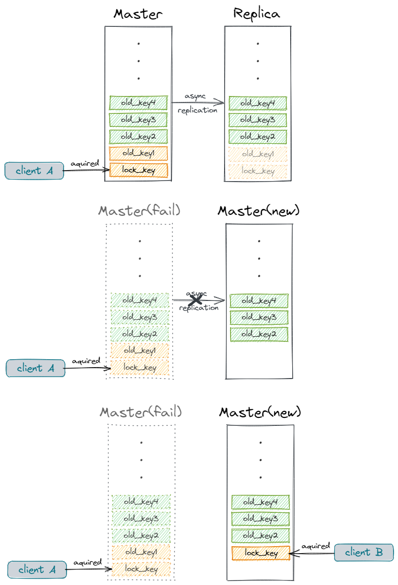

# Redis分布式锁

在分布式环境下，分布式锁是个相当有用的技术，常见的分布式锁的实现有基于数据库、zookeeper、Redis，这里主要讲Redis的分布式锁。本文是翻译整理于官方文档[Distributed locks with Redis](https://redis.io/topics/distlock)。

本文提出了Redis分布式锁的一种比较规范的算法，官方称之为Redlock。这个算法相对于一些单节点的方案来说更可靠一点。

## 1 安全性和可用性

该锁的设计者认为，一个合格的分布式锁，至少应当具备以下三个属性：

1. 安全性（Safety property）：**互斥**，同一时间只能有一个客户端持有锁。
2. 可用性一（Liveness property）：**无死锁**，所有锁最终都应当被释放，即使持有锁的客户端崩溃了或出现了网络隔离。
3. 可用性二：**容错**，只要（Redis）集群的大部分节点都在工作，分布式锁仍能正常占有或释放锁。

## 2 为什么基于故障转移的方案不太行

既然说现有的一些方案不太行，那我们就得扒一扒不行在哪里，并针对性地做出改进。

一般一个简单的基于Redis的分布式锁的方案是：使用一个单节点的redis，成功创建一个key，作为客户端持有锁的标志，一般这个key都会设置一个超时时间，以能保证锁的最终释放（可用性一）。当客户端需要释放锁时，删除key就行了。

这看起来没什么问题，而且大部分时间都没啥问题，但是问题是存在的：**单点故障**。单节点挂了咋办？加从节点啊，主节点挂了从节点上。但是这依旧不太行，因为我们需要保证分布式锁的互斥（安全性），而Redis的主从复制是异步的。在极端场景中，大概率会发生这种情况（race condition）：

1. 客户端A在主节点中占用了一个锁（key）。
2. 主节点宕机，但该key还没来得及复制到从节点。
3. 触发故障转移机制，从节点被提升为主节点。
4. 客户端B在新的主节点中拿到了相同的锁。**互斥失效了！**



看具体业务场景吧，可能有的业务在故障发生时，允许多个客户端同时持有同一把锁，那么用这个基于故障转移的方案也没什么问题。但是我觉得大部分用到分布式的场景中，出现这种状况是不能接受的。

## 3 单节点方案的正确操作

这节讨论的算法是基于“一个永远不会挂的单节点Redis实例”方案。

为了解决在竞争时可能出现的“**误删其他客户端持有的锁**”的问题，我们引入一个随机数，用于标记一个锁。比如在获取锁时，这么做：

```shell
SET resource_name my_random_value NX PX 30000
```

`NX`选项来限制只有该key不存在时才能添加key成功，`px`选项设置锁的超时时间是30000毫秒。该key的值被设置为一个随机数，这个随机数必须是全局唯一的。

这个随机数将用来保证释放锁时的安全性：客户端在删锁时必须保证本地记录的随机数与该key存的随机数一致。一般通过lua脚本来实现：

```lua
if redis.call("get",KEYS[1]) == ARGV[1] then
    return redis.call("del",KEYS[1])
else
    return 0
end
```

lua脚本保证了“查key存的值”、“校验key的值是否一致”、“删除key”这三个操作的原子性，如果不能保证原子，还是会出现安全问题，比方说：

1. 客户端A占用了一个锁（a_key），并设置了超时时间。
2. 客户端A准备释放锁，**查询（a_key）对应的随机数**。
3. **客户端A校验随机数OK**，准备释放锁。
4. a_key过期。
5. 客户端B占用该锁（a_key）。
6. **客户端A删除锁（a_key）**。

客户端A将客户端B占用的锁释放掉了！

| 时间点 | 客户端A                                   | 客户端B           |
| ------ | ----------------------------------------- | ----------------- |
| time1  | SET a_key random_value1 NX PX 3000        |                   |
| time2  | 处理业务结束，GET a_key得到 random_value1 |                   |
| time3  | random_value2校验OK                       |                   |
| time4  | a_key超时，锁失效                         |                   |
| time5  |                                           | SET a_key加锁成功 |
| time6  | DEL a_key释放锁                           |                   |

可见通过lua脚本来保证原子操作的重要性。这一节的方案适用于单节点Redis，且假设了不会发生单点故障，但如果在分布式的Redis部署中，我们应该采用什么方案呢？

## 4 Redlock算法

在分布式版本的方案中，我们假定有N个Redis主节点，所有节点相互之间独立，而且不引入主从复制机制或其他分布式协调机制。在上一节中我们已经有了在单节点中的安全的分布式锁方案，在这里的单个节点中我们也会沿用这个方案。

为了获取锁，客户端需要进行如下操作：

1. 获取当前时间戳（毫秒）。
2. 依次在N个节点上尝试获取锁，在所有节点上均使用同一个key与同一个随机数。在这一步里，我们需要引入一个较短的超时时间，以应对某个节点不可达的情况，比方说，锁的失效时间设置为10秒的话，该超时时间可以设为5~50毫秒的范围。一旦发现某个节点超时未响应，应当立刻转向下个节点。
3. 通过计算当前时间戳减去步骤一中的时间戳，得到**获取锁所消耗的时间**。如果在majority数量（如果N=5，那么majority就是3）上成功获取到锁，而且获取锁所消耗的时间小于锁的失效时间，那么我们将认为成功获取到了锁。
4. 一旦成功获取到锁，那么锁的实际失效时间 = 锁的设置失效时间 - 获取锁消耗的时间。
5. 万一没能成功获取到锁，那么需要在所有N个节点上尝试释放锁（需要参照第3节的方案）。

Redlock算法通过多master节点均上锁来保证了只有少数节点失效时，分布式锁集群的高可用；引入锁的客户端“签名”（随机数）与lua脚本保证释放锁操作的原子性，来控制释放锁时的安全性；计算锁的实际失效时间来解决多节点同时上锁时，锁失效时间不一致的问题。

## 5 关于失败重试

在加锁的过程中免不了发生竞争，出现竞争后必然有至少一个客户端加锁失败。失败了怎么办，业务代码总不能不执行了吧？
