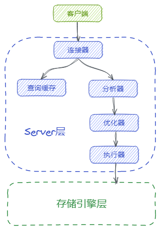

# MySQL基础架构

接下来的部分是MySQL的学习笔记，先从宏观上看一看MySQL的基础架构，看一看MySQL有哪些基础的模块，几个模块是如何配合的，以及一条SQL在MySQL中是如何被执行的。MySQL的这部分内容大部分学习自[《MySQL实战45讲》](https://time.geekbang.org/column/intro/139)。

先看看MySQL大致有哪些模块。总体上来说，MySQL可以分为**Server层**与**存储引擎层**。Server层的作用包括处理客户端连接、鉴权、SQL语法分析、生成执行计划（explain）、缓存管理、操作存储引擎等。存储引擎层就是负责数据的存储和查询。MySQL支持多个存储引擎：InnoDB、MyISAM、Memory等，最常用的就是InnoDB。

刚刚讲的Server层中又有多个不同的模块分别负责不同的功能，比如有：

- 连接器：处理客户端的连接，负责权限认证。
- 查询缓存：负责缓存历史查询sql的结果。
- 分析器：执行词法与语法分析。
- 优化器：生成执行计划，并选择使用的索引。
- 执行器：负责操作存储引擎，并返回结果。



## 1 连接器

对于客户端来说，想要与数据库交互，现要与数据库建立连接。连接器就是负责等待客户端的连接，建立连接，校验用户名密码（认证），校验权限（鉴权），并维护与管理连接。

比如通过终端连接：

```shell
mysql -h127.0.0.1 -P3306 -uroot -p
```

在随后的交互中输入密码，终端（客户端）会与MySQL建立连接，接着连接器就会校验你登陆的用户名与密码。如果校验失败，则会给你一个`"Access denied for user"`错误。用户名密码认证通过后，连接器会从权限表中查出你的权限，并据此限制你后面的数据库操作。不过如果在已经成功连接后，再有人修改你登陆的用户的权限，也不会影响你当前已有的权限（登陆时查出的权限），新的权限会在你重新连接后刷新。

客户端与MySQL建立的连接一般都是长连接，后续的SQL执行都是依赖此连接。不过连接器还会处理长时间不活动的连接，可以通过`show processlist`查看连接的状态与连接的时长。一般如果某个连接空闲超过8小时，连接器会断开该连接，这个8小时可以通过参数`"wait_timeout"`控制。

## 2 查询缓存

在MySQL服务器接收到一条查询sql后，会先去检查“查询缓存”，如果命中了缓存，则会立刻向客户端返回存储在查询缓存中的记录（结果），否则继续后面的执行阶段。执行完成后，查询结果会被放入查询缓存中。

可以通过`SHOW VARIABLES LIKE 'have_query_cache'`查看当前数据库版本是否支持查询缓存，并通过`SHOW VARIABLES LIKE 'query_cache_type'`查看当前是否开启了查询缓存。可通过参数`query_cache_type`来控制开启查询缓存，`0`或`OFF`表示关闭，`1`或`ON`表示开启，`2`或`DEMAND`表示按需使用查询缓存，意思是只有在sql中显示指定（SQL_CACHE）才会使用查询缓存。

在实际使用中一般不会开启查询缓存，因为查询缓存的失效非常频繁，**对于表的更新操作会直接清空该表对应的所有查询缓存**。除非你的数据库存的是配置之类的静态数据，大部分时间是不发生变更的，才需要考虑开启查询缓存。

而且MySQL 8.0直接干掉了查询缓存这个功能。

## 3 分析器

上面说到查询缓存，如果一条查询sql未命中查询缓存，执行过程就会走到分析器。在这一步，MySQL会知道**你要做什么**。分析器的作用是对输入的sql做词法分析和语法分析。拿一条sql举例：

```sql
SELECT * FROM T WHERE ID = 1;
```

词法分析的作用是识别这条sql每个字符串代表的含义，比如识别出`SELECT`，知道了这是一条查询语句，将`T`识别为`表T`，将`ID`识别为`列ID`。

词法分析做完后会做语法分析，会根据词法分析的结果及SQL规则这条sql是否满足MySQL语法规范。

语句有问题就会抛出“*You have an error in your SQL syntax*”。

## 4 优化器

sql通过了分析器的分析后，在执行之前，还需要对sql做一次优化。在优化器这一步，MySQL会知道**该怎么做**。比如有多个索引时决定索引的使用，比如在关联查询时，决定连接的顺序。

还是拿sql举例：

```sql
SELECT * FROM t1 JOIN t2 USING(id) WHERE t1.c = 'x' and t2.d = 'y';
```

试想一下，MySQL要执行这条查询，可以怎么做？

> 在t1中命中一条c = 'x'的记录，拿这条记录的id去t2中查询对应id的记录，再看t2中这条记录的d是否等于'y'。

这不是唯一解法，还可以从t2入手：

> 在t2中命中一条d = 'y'的记录，拿t2中的这条记录的id去t1中查询对应的记录，再看t1中的这条记录的c是否等于'x'。

优化器需要决定的是这两种方式哪种最优。

## 5 执行器

一条sql经过了前面几个模块的处理，就确定了如何去执行这条sql。执行器阶段就是执行这条sql。

执行器在执行查询前还需要校验当前用户对于目标表是否有查询权限，如果没有查询权限，就会拒绝执行查询：“*ERROR 1142 (42000): SELECT command denied to user 'user'@'localhost'for table 'T'*”。

通过权限校验后，就会调用存储引擎的接口查询对应的记录。（先查出这个表中满足条件的第一行，之后循环查取满足条件的下一行，直至遍历整个表或索引。）
