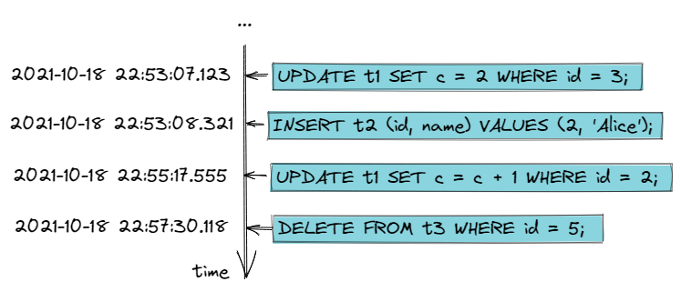

# MySQL数据库备份与恢复

人生难以预测，你不知道你走的路，前方是花丛，还是个坑。就像你的运维同学，不知道什么时候就会删库跑路。。当然更可能的是领导让你删除一条脏数据，你却忘了加where条件。遇到这种情况怎么办？祈祷你的数据库有定时备份，且开启了binlog。

一般来说，常规的恢复方案是：定期的数据库备份 + binlog，可以让数据库恢复到任一时间点的状态（一定时间范围内的，取决于备份的频率与binlog日志归档的时长）。

这听起来就很厉害了，怎样才能恢复到任意时间点呢？要知道binlog记录的是每一条的写操作，光靠binlog是无法恢复整个数据库的，形象点描述binlog：

详细的mysqldump参数：《[MySQL mysqldump数据导出详解](https://www.cnblogs.com/chenmh/p/5300370.html)》

