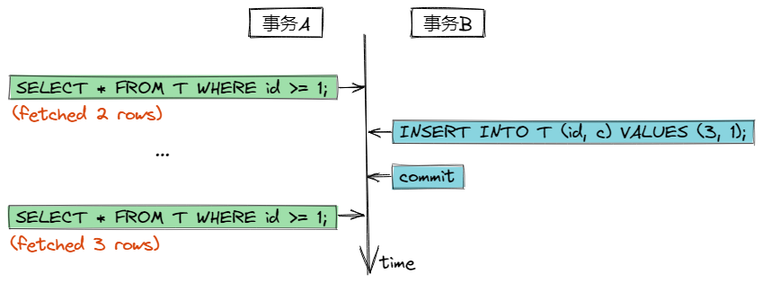

# MySQL事务

数据库事务是个老生常谈的东西。一个事务指的是一组对数据库的操作集合（序列），这组操作要么全部执行，要么全部不执行。一个事务可以看成是一个独立的、不可分割的单位。

## 1 事务的ACID

ACID是保证数据库事务正确可靠的四个特性：

- 原子性（Atomic）：一个事务中的所有操作，要么全部完成，要么全部不完成。事务中任意步骤出错，整个事务会回滚到事务初始的状态（好像事务没执行过一样）。
- 一致性（Consistency）：事务前后数据的状态是一致的，事务对数据的变更，会保证数据的完整性，符合预设的规则。比如转账前后，两个账户的金额总和是不变的。
- 隔离性（Isolation）：事务的执行是独立的，一个事务的执行不会影响另一个事务的执行。
- 持久性（Durability）：完成的事务（提交成功的），其对数据的变更是永久的。即使紧跟着系统崩溃，也不会导致数据（变更）的丢失。

## 2 隔离性与事务中的问题

我们把ACID中的'I'（隔离性）展开讲讲。要知道“隔离”实际上并不是绝对的，“隔离”的概念发生在多个事务同时执行时，绝对的“隔离”会导致低效率（需要使本应并行的事务串行执行，绝对不会互相干扰，就像Java并发中的同步锁，安全，但性能肯定跟不上）。

显然这样是没有必要的，但是允许并行执行事务，可能会导致一些问题：

### 2.1 脏读（Dirty Read）

**脏读是一个事务读取到了另一个事务未提交的内容。**图示：

图示中事务A读取到了事务B未提交的值更新（2），然后依据此值做了计算，并提交到数据库中，结果事务B却回滚了。从此破坏了数据的一致性。

### 2.2 不可重复读（Unrepeatable Read）

**不可重复读是在同一个事务中，前后两次读取到的内容不一致。**图示：

图示中事务A对c值的第二次读取，与第一次读到的值不同，原因是事务B在事务A执行期间更新了c值并提交成功。

### 2.3 幻读（Phantom Read）

**幻读是一个事务根据条件查询到的数据集，在第二次以相同条件查询到了不同的数据集。**图示：

事务A以条件`id >= 1`查询，匹配到了2行数据，事务B跟着插入了新的一行数据并提交了，事务A再次以条件`id >= 1`查询，却匹配到了3行数据。（看着与不可重复读类似？有本质区别，下面会讲到应对不可重复读的隔离级别，通过对已读到的数据记录加锁，锁不住新增的记录行。）

## 3 隔离级别

对于上述提及的几个问题，本质上是不同“隔离”程度中会发生的现象，SQL标准定义了四个隔离级别：

- 读未提交（Read Uncommitted ）
- 读已提交（Read Committed）
- 可重复读（Repeatable Read）
- 序列化（Serializable ）

### 3.1 读未提交（Read Uncommitted ）

读未提交是最低级别的隔离，在此级别下，一个事务能够读到其他事务未提交的改动，这就导致了“脏读”现象。这个级别等于是事务之间没做隔离。

### 3.2 读已提交（Read Committed）

读已提交保证了事务中能够读取到的值必须是其他事务已经提交的内容，这杜绝了“脏读”现象。这个级别下，当前事务持有了当前行的读写锁，阻止了其他事务对改行数据的读写操作。

### 3.3 可重复读（Repeatable Read）

这个级别是MySQL的默认隔离级别。可重复读保证了事务从开始到结束，期间任何时候读到的数据行的内容都是一致的。在这个级别下，事务在第一个读操作会建立一个当前读的“快照”，事务的后续操作都是基于此“快照”做的（下面讲）。