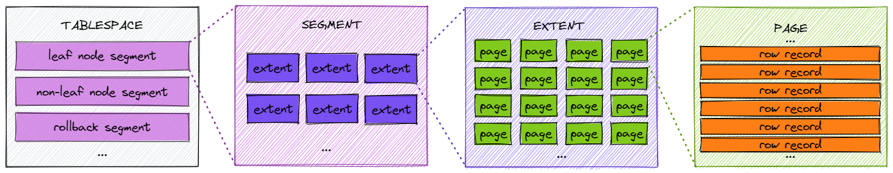
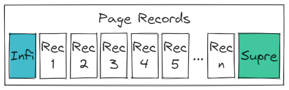
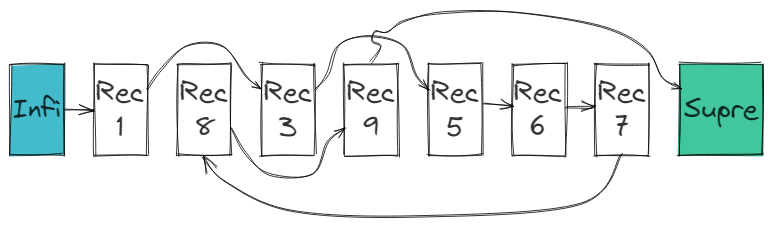
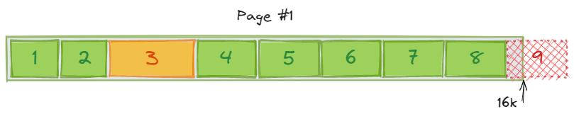
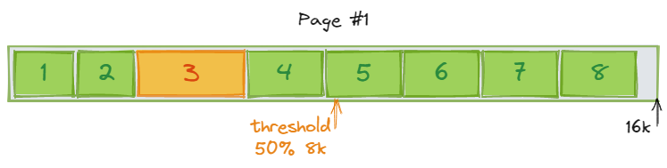
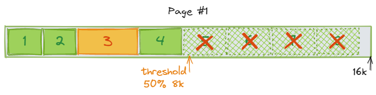
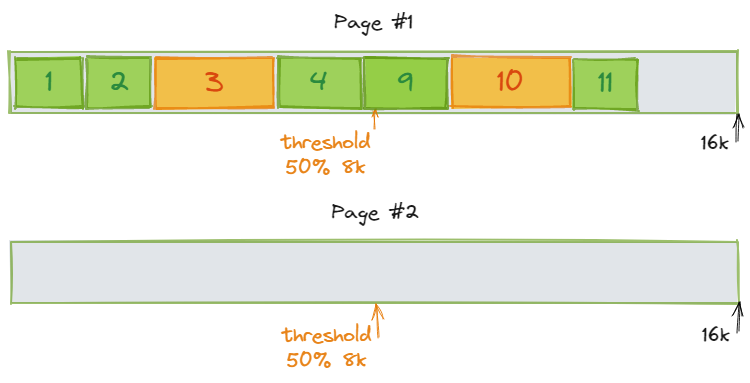
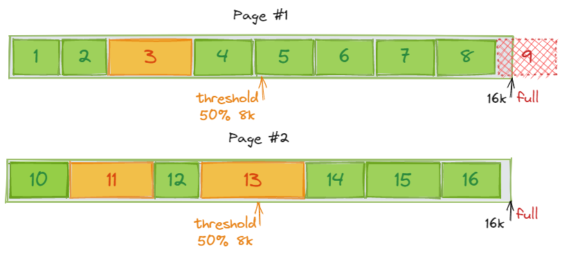
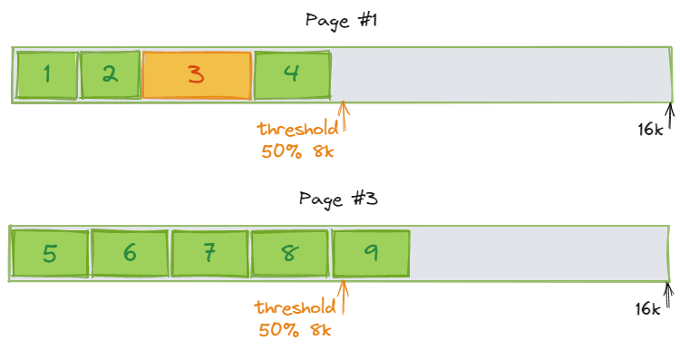
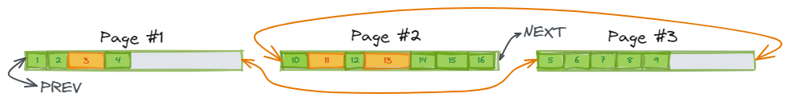

# MySQL索引

索引对于MySQL使用者来说是个非常常见的词汇，也是数据库系统中的非常重要的概念之一。**索引是通过指定列值快速查找特定行的技术。**其目的就是提高查询数据的效率，索引的英文*index*，也是目录的意思，就像在一本书中寻找特定内容，可以通过目录快速定位到目标内容附近。如果没有目录的话，你得从这本书的第一页开始查找。

MySQL中的索引是存储引擎的实现，所以不同引擎的索引的实现方式和工作原理可能都不相同，大部分索引的类型都是B+树，一些用Hash表的比如MEMORY引擎，其他还有FULLTEXT等等。我们这里只讲讲InnoDB的索引。

## 1 聚簇索引与辅助索引

InnoDB使用了B+树索引模型，每一个索引都对应一棵B+树。这里又可以细分为聚簇索引（Clustered Index）和非聚簇索引（也叫辅助索引Secondary Index）。它俩的区别是：

- 聚簇索引 - 一般等同于主键索引，对于非叶子节点，存放的是索引值，叶子节点是整行数据。
- 辅助索引 - 非聚簇索引的都是辅助索引，比如组合索引，其非叶子节点存放的是键值，叶子节点存放的是主键。（这里的“辅助”比较形象，查询条件命中辅助索引，然后拿到主键再去聚簇索引查行数据）

下面我们举个例子来帮助理解，

```mysql
CREATE TABLE t (id INT PRIMARY KEY, c INT, data_c VARCHAR(8)INDEX(c)) ENGINE = InnoDB;
INSERT INTO t (id, c) VALUES (1,200),(2,300),(3,400),(4,500),(5,600);
COMMIT;
```

现在我们有了个表t，列*id*为主键，列*c*为辅助索引列，*data_c*为某数据列。那么会存在两棵索引树：


如果有一条查询sql：

```mysql
SELECT * FROM t WHERE id = 3;
```

那么只需要在聚簇索引中，找到id=3的叶子节点，从该叶子节点得到整行数据。

但如果有一条查询sql是：

```mysql
SELECT * FROM t WHERE c = 300;
```

那么需要：

1. 从辅助索引(c)上，找到c=300的节点，从该叶子节点上得到对应的行主键（id）是3。
2. 再从聚簇索引上找id=3的节点，从叶子节点上取得整行数据。

第二个sql的这个查询过程，我们称之为**回表**。

## 2 页合并与页分裂

这俩概念还是蛮复杂的，但是它们与InnoDB的性能息息相关，是设计数据库索引时必须要考虑到的东西。

### 2.1 数据文件结构

我们先从数据文件结构讲起，一般来说，一张表会对应一个data目录下的数据文件（`innodb_file_per_table=1`），比如我们在test_db库中建一张test_table表，在data目录下就会生成对应的表文件：

```
data/
-test_db/
---test_table.frm
---test_table.ibd
```

这里的`test_table.ibd`就是test_table表的数据文件，一般我们也叫它表空间。

表空间由多个段（**Segment**）组成。有叶子节点段（leaf node segment）、非叶子节点段（non-leaf node segment）、回滚段（rollback segment）。

每个段被划分为多个区（**Extent**）。

每个区是多个页（**Page**）组成的集合。

每一页中又有多条行数据。

（就像套娃一样。。）



默认一个页的大小是16KB，那么一个extent包含64个页，extent的大小固定是1MB，当页的大小是4KB、8KB、16KB时，extent的大小都是1MB。MySQL 5.7.6以后支持了32KB和64KB的页：

| Page Size | Extent Size | Pages in an extent |
| :-------: | :---------: | :----------------: |
|    4KB    |     1MB     |        256         |
|    8KB    |     1MB     |        128         |
|   16KB    |     1MB     |         64         |
|   32KB    |     2MB     |         64         |
|   64KB    |     4MB     |         64         |

*（参考[glossary-extent](https://dev.mysql.com/doc/refman/5.7/en/glossary.html#glos_extent)及[InnoDB: Tablespace Space Management](https://dev.mysql.com/blog-archive/innodb-tablespace-space-management/)及[Extent Descriptor Page of InnoDB](https://dev.mysql.com/blog-archive/extent-descriptor-page-of-innodb/)）*

### 2.2 页的结构

*（参考[InnoDB Page Structure](https://dev.mysql.com/doc/internals/en/innodb-page-structure.html)）*

页是InnoDB操作数据的基础单位，InnoDB每次在磁盘（数据文件）与内存（缓冲池buffer pool）之间传输数据都是以页为单位的。

一个页包含七个部分：

- **Fil Header** - 页文件头
- **Page Header** - 页头
- **Infimum + Supremum Records** - 首尾记录行
- **User Records** - 用户记录行
- **Free Space** - 空白空间（未使用）
- **Page Directory** - 页目录
- **Fil Trailer** - 页文件尾

#### 2.2.1 Fil Header

页文件头包含八个部分：

| 名称                      | 大小 | 描述                                                         |
| ------------------------- | ------ | ---------------------------------------------------------- |
| `FIL_PAGE_SPACE`          | 4    | 当前页所处的空间的ID                     |
| `FIL_PAGE_OFFSET`         | 4    | 当前空间中该页所排的序号            |
| `FIL_PAGE_PREV`           | 4    | 指向前一页的指针（偏移量）             |
| `FIL_PAGE_NEXT`           | 4    | 指向后一个页的指针（偏移量）               |
| `FIL_PAGE_LSN`            | 8    | [LSN](https://dev.mysql.com/doc/refman/5.7/en/glossary.html#glos_lsn)是日志序列号，用于标记版本，`FIL_PAGE_LSN`当前页的最新（改动）的日志记录序列号 |
| `FIL_PAGE_TYPE`           | 2    | 当前页的类型，目前有这些: `FIL_PAGE_INDEX`, `FIL_PAGE_UNDO_LOG`, `FIL_PAGE_INODE`, `FIL_PAGE_IBUF_FREE_LIST` |
| `FIL_PAGE_FILE_FLUSH_LSN` | 8    | 一个[LSN](https://dev.mysql.com/doc/refman/5.7/en/glossary.html#glos_lsn)，标识了当前已经写（flush）到文件中的日志记录序列号（版本）。该值只在数据文件的第一个页中有效。 |
| `FIL_PAGE_ARCH_LOG_NO`    | 4    | 当前`FIL_PAGE_FILE_FLUSH_LSN` 写进的归档日志的编号。该值也是只在数据文件的第一个页中有效。 |

#### 2.2.2 Page Header

页头这块共有14个部分：

| **名称**            | **大小** | **描述**                                                     |
| ------------------- | -------- | ------------------------------------------------------------ |
| `PAGE_N_DIR_SLOTS`  | 2        | Page Directory这块的目录槽的数量，初始值是2                  |
| `PAGE_HEAP_TOP`     | 2        | 指向heap（堆）中第一条记录的指针                             |
| `PAGE_N_HEAP`       | 2        | 堆中记录的总条数，初始值是2（Infimum与Supremum）             |
| `PAGE_FREE`         | 2        | 指向页中空闲空间的位置                                       |
| `PAGE_GARBAGE`      | 2        | 已删除的记录的大小（bytes）                                  |
| `PAGE_LAST_INSERT`  | 2        | 指向最后一条新增记录的指针（最后插入记录的位置）             |
| `PAGE_DIRECTION`    | 2        | 记录的操作方向，有`PAGE_LEFT`、 `PAGE_RIGHT`、 `PAGE_NO_DIRECTION` |
| `PAGE_N_DIRECTION`  | 2        | 同一方向连续插入的记录数，比如“最近5条记录都是向左新增”      |
| `PAGE_N_RECS`       | 2        | 用户记录数量（不算Infimum与Supremum）                        |
| `PAGE_MAX_TRX_ID`   | 8        | 修改当前的最大事务ID （该值只对辅助索引有效）                |
| `PAGE_LEVEL`        | 2        | 当前页在索引树中的位置层 （叶子节点是0层）                   |
| `PAGE_INDEX_ID`     | 8        | 当前页所属索引的标识id                                       |
| `PAGE_BTR_SEG_LEAF` | 10       | B+树叶子节点所在Segment的header信息                          |
| `PAGE_BTR_SEG_TOP`  | 10       | B+树非叶子节点所在Segment的header信息                        |

#### 2.2.3 Infimum与Supremum记录

这俩是页中自带的虚拟记录，标识了页中记录的边界。Infimum记录比该页中任何一个key都小，Supremum比该页中任何一个key都大。



#### 2.2.4 User Records

这里就是用户插入的记录。

整个页中的所有记录是一条单向链表，每条记录都维护了一个指向下一个记录的指针。根据定义，B+树访问记录的顺序必须按照键值的顺序，所以为了减少插入新行的开销，不能做数据的移动（不能整理因中间某行被删除造成的空间碎片)，所以新插入行时，会往这两个位置插入：

1. 现有行末尾的空闲空间
2. 已删除行留下的空闲空间

所以在逻辑顺序上，记录之间按照key的顺序排列，但是在物理顺序上，记录之间可能是乱序的：



#### 2.2.5 Free Space

空闲空间分为两个部分，一个是从未使用过的，崭新的空闲空间，另一个是删除行记录后留下的空闲空间。

#### 2.2.6 Page Directory

页目录是一系列指向当前页中记录的指针。有的地方将这些记录指针称之为“槽（slots）”。需要注意的是，这些槽并不是与记录一一对应的，在一个“被装满”的页中，一个槽对应六条记录。

这些槽以“逻辑顺序”追踪页中记录（区别于上述提及的物理顺序），当搜索的时候，可以根据槽确定目标记录的大致位置，然后再根据记录间的`next`指针（上述提及的记录间的单向链表）依次找到精确记录。

#### 2.2.7 Fil Trailer

页文件尾的结构很简单，它只有一个部分：

| 名称               | 大小 | 描述                                                         |
| ------------------ | ---- | ------------------------------------------------------------ |
| `FIL_PAGE_END_LSN` | 8    | 低位4字节是当前页面的*checksum*，剩下4位与页文件头中的`FIL_PAGE_LSN`相同 |

页文件尾的存在表达了InnoDB设计者对文件完整性的担忧吧。虽然日志恢复机制总能保证页的保存能够维持一个一致性的状态（即使是崩溃中断）。但是万事就怕万一，在文件尾加上个checksum，并记录一个能与页头呼应（相同）的值，总归是不错的。

### 2.3 页合并与页分裂

*（参考[InnoDB Page Merging and Page Splitting](https://www.percona.com/blog/2017/04/10/innodb-page-merging-and-page-splitting/)）*

上面我们提到页的大小都是固定的，我们拿聚簇索引来讲，如果建表时选用了自增长的主键（auto_increment），那么在每个页上，记录都是顺序添加的。比如insert记录1、2、3、4，那么在第一页，记录1、2、3、4依次按顺序被添加：


每个记录的大小可能会有差异。我们陆续向表中新增记录，直到快要填满这一页，再继续往这页中新增记录的话肯定放不下了：



当一页被放满后，新增的记录会被放到下一页中：


#### 2.3.1 页合并

每一个页都有一个非常重要的属性：***MERGE_THRESHOLD***，其表示了操作页合并的（页已使用比例）阈值，默认值是页大小的50%。



还有需要了解的是，当你删除一条记录，它并不会被物理删除，其只是打上了一个“被删除”的标签，其所占空间成为可回收的free space。

当对记录的删除或是更新，使得当前页的使用空间百分比低于50%时，InnoDB会尝试查看相邻页（前一页与后一页）是否满足合并的条件。




在上图的例子中，Page #1删除了5、6、7、8记录，其剩余记录的空间占比触及（低于）阈值8k，而且此时Page #2中，记录已占用空间未达50%，InnoDB就会认为这俩页目前可以合并。Page #2中的记录会被移至Page #1，Page #2成为一个空页，等待新纪录的到来。



*（[`MERGE_THRESHOLD`可为表或单独为索引设置](https://blog.csdn.net/wanbin6470398/article/details/82184383)）*

#### 2.3.2 页分裂

还记得上面的例子吗，往Page #1中新增记录，但是放不下了，这条新纪录会被放置到Page #2中。但是还存在一种情况，这条新增不是按照key顺序的，此时Page #2也是满的怎么办？



这时就会触发页分裂，InnoDB的操作步骤可以简化描述为：

1. 创建新的一页
2. 决定Page #1从哪条记录开始分割
3. 转移记录
4. 重定义页之间的关系

那么，先新建Page #3，并将Page #1中的数据部分转移到新页中：



并重新关联这仨页之间的关系：



与页中记录类似，页与页之间也是逻辑顺序有序，但物理顺序无序的。（但页之间是双向链表）

## 3 索引覆盖

**索引中若能包含需要查询的字段，那就直接返回结果，不需要回表。**

这还是比较好理解的，如果辅助索引的字段，就包含了需要查询的字段（比如SELECT组合索引中的某个字段，或是SELECT id），那就没必要命中辅助索引之后再去主键索引查一遍。

举个例子，现有一张user表：

```sql
CREATE TABLE user (id INT PRIMARY KEY, age INT, name VARCHAR(128), 
                   KEY`name_age` (`name`,`age`)) ENGINE = InnoDB;
```

那么这条查询sql就不需要回表：

```sql
SELECT age FROM user WHERE name = 'Alice';
```

## 4 最左前缀原则


## 5 索引下推
