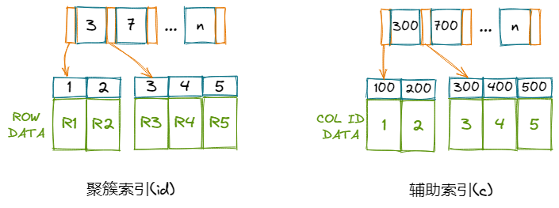

# MySQL索引

索引对于MySQL使用者来说是个非常常见的词汇，也是数据库系统中的非常重要的概念之一。**索引是通过指定列值快速查找特定行的技术。**其目的就是提高查询数据的效率，索引的英文*index*，也是目录的意思，就像在一本书中寻找特定内容，可以通过目录快速定位到目标内容附近。如果没有目录的话，你得从这本书的第一页开始查找。

MySQL中的索引是存储引擎的实现，所以不同引擎的索引的实现方式和工作原理可能都不相同，大部分索引的类型都是B+树，一些用Hash表的比如MEMORY引擎，其他还有FULLTEXT等等。我们这里只讲讲InnoDB的索引。

## 1 聚簇索引与辅助索引

InnoDB使用了B+树索引模型，每一个索引都对应一棵B+树。这里又可以细分为聚簇索引（Clustered Index）和非聚簇索引（也叫辅助索引Secondary Index）。它俩的区别是：

- 聚簇索引 - 一般等同于主键索引，对于非叶子节点，存放的是索引值，叶子节点是整行数据。
- 辅助索引 - 非聚簇索引的都是辅助索引，比如组合索引，其非叶子节点存放的是键值，叶子节点存放的是主键。（这里的“辅助”比较形象，查询条件命中辅助索引，然后拿到主键再去聚簇索引查行数据）

下面我们举个例子来帮助理解，

```mysql
CREATE TABLE t (id INT PRIMARY KEY, c INT, data_c VARCHAR(8)INDEX(c)) ENGINE = InnoDB;
INSERT INTO t (id, c) VALUES (1,200),(2,300),(3,400),(4,500),(5,600);
COMMIT;
```

现在我们有了个表t，列*id*为主键，列*c*为辅助索引列，*data_c*为某数据列。那么会存在两棵索引树：



如果有一条查询sql：

```mysql
SELECT * FROM t WHERE id = 3;
```

那么只需要在聚簇索引中，找到id=3的叶子节点，从该叶子节点得到整行数据。

但如果有一条查询sql是：

```mysql
SELECT * FROM t WHERE c = 300;
```

那么需要：

1. 从辅助索引(c)上，找到c=300的节点，从该叶子节点上得到对应的行主键（id）是3。
2. 再从聚簇索引上找id=3的节点，从叶子节点上取得整行数据。

第二个sql的这个查询过程，我们称之为**回表**。

## 2 页合并与页分裂

这俩概念还是蛮复杂的，但是它们与InnoDB的性能息息相关，是设计数据库索引时必须要考虑到的东西。

### 2.1 数据文件结构

我们先从数据文件结构讲起，一般来说，一张表会对应一个data目录下的数据文件（`innodb_file_per_table=1`），比如我们在test_db库中建一张test_table表，在data目录下就会生成对应的表文件：

```
data/
-test_db/
---test_table.frm
---test_table.ibd
```

这里的`test_table.ibd`就是test_table表的数据文件，一般我们也叫它表空间。

表空间由多个段（**Segment**）组成。有叶子节点段（leaf node segment）、非叶子节点段（non-leaf node segment）、回滚段（rollback segment）。

每个段被划分为多个区（**Extent**）。

每个区是多个页（**Page**）组成的集合。

（就像套娃一样。。）