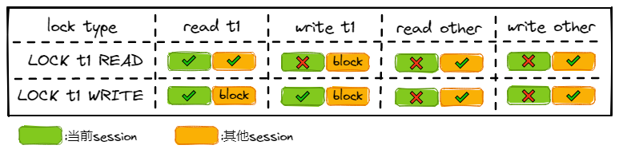
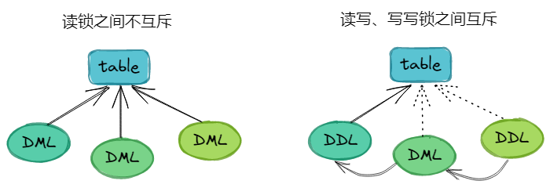

# MySQL锁

锁嘛，对付并发用的。MySQL中的锁，根据锁定的范围，可以大致分为**全局锁**、**表级锁**与**行级锁**。

## 1 锁定范围

### 1.1 全局锁

很显然的，全局锁就是给整个MySQL实例加锁，有个命令：

```shell
FLUSH TABLES WRITE READ LOCK
```

这个FTWRL命令会给整个MySQL加上只读锁，加锁后这些操作会被阻塞：

1. 数据更新语句（数据的增删改）
2. 数据定义语句（包括建表、修改表结构等）
3. 更新类事务的提交语句

这个锁是相当重量级的，看起来比较危险，毕竟阻塞了所有写操作。**它一般用于备份工具获取一致性备份。**不过对于InnoDB引擎来说，由于MVCC的支持，在可重复读的隔离级别下，无需阻塞写操作就能得到一致性的备份（`mysqldump`带上`--single-transaction`）。

### 1.2 表级锁

MySQL的表级锁分为：

- 表锁
- 元数据锁（MDL，Meta Data Lock）

#### 1.2.1 表锁

表锁就是[`LOCK TABLES t1 READ|WRITE`](https://dev.mysql.com/doc/refman/5.7/en/lock-tables.html)。

对t1加read锁的话：

- 当前session对t1只能read，不能write。
- 当前session对其他表不能read且不能write。
- 其他session对t1的write操作会阻塞。
- 其他session对其他表的操作无影响。
- 其他session可以同时对t1加read锁。

对t1加write锁的话：

- 当前session对t1可以read与write。
- 其他session对t1不能read，且不能write。
- 其他session同时对t1的加write锁操作会被阻塞，直至当前session释放write锁。

对表t1加表锁情况对比：



`WRITE`锁的优先级要比`READ`锁要高，因为MySQL想要保证更新操作尽可能快地执行完。比如有一个session正在获取`READ`锁，然后另一个session在请求`WRITE`锁，那么后续的`READ`锁请求会阻塞，直至持有`WRITE`锁的session释放锁。

释放锁只需要执行：

```sql
UNLOCK TABLES;
```

session断开也会自动释放锁。

#### 1.2.2元数据锁

元数据锁MDL([Metadata Locking](https://dev.mysql.com/doc/refman/5.7/en/metadata-locking.html))主要作用是维护表元数据的数据一致性，**用于保证DDL操作与DML操作之间的一致性**。

MDL不需要显示地调用，每次执行DML语句时会申请MDL读锁，每次执行DDL语句时会申请MDL写锁。读锁之间不互斥，比如多个session可以同时对同一张表增删改查。但是读锁与写锁、写锁之间是互斥的。而且存在一个锁申请队列，队列中写锁的优先级是高于读锁的。



MySQL 5.7新增了一张只读表`performance_schema.metadata_locks`，专门用来记录MDL的相关信息。不过5.7中是默认关闭的，需要这么开启：

```sql
UPDATE performance_schema.setup_instruments
SET ENABLED = 'YES', TIMED = 'YES'
WHERE NAME = 'wait/lock/metadata/sql/mdl';
```

*参考《[深入理解MDL元数据锁](https://cloud.tencent.com/developer/article/1553461)》与《[MySQL元数据锁(MDL)](http://mytecdb.com/blogDetail.php?id=183)》*

### 1.3 行级锁

行级锁是InnoDB的机制，其依赖于行锁，可以支持多个事务并发地修改同一张表。但当有两个事务同时修改同一个行数据时，其中一个事务需要等待另一个事务执行完毕。

行锁就是加在行上的锁，是防止其他事务同时修改当前行的锁。行锁的存在大大降低了锁定的粒度，提到了数据库访问的并发读（否则并发控制只能走表锁，比如 MyISAM）。

## 2 实现类型

*参考[14.7.1 InnoDB Locking](https://dev.mysql.com/doc/refman/5.7/en/innodb-locking.html)*

### 2.1 共享锁与排他锁

这俩锁是InnoDB对于行级锁的两种实现，其区别在于：

- 共享锁允许持有其的事务对行进行读操作。
- 排他锁允许持有其的事务对行进行写操作（更新或删除）。

举个例子，如果事务`t1`持有了行`r`的共享锁，那么此时另一个事务`t2`对于行`r`的锁请求操作会被如下处置：

- `t2`对行`r`的共享锁请求会被立刻准予，`t1`与`t2`同时持有行`r`的共享锁。
- `t2`对行`r`的排他锁请求**不会**被准予（等待）。

同样的，若`t1`持有的是行`r`的排他锁，那么无论是`t2`的共享锁请求，还是排他锁请求，都不会被准予，`t2`的锁请求操作都需要等待`t1`释放行`r`的排他锁。

### 2.2 意向锁

### 2.3 记录锁（行锁）

### 2.4 间隙锁

### 2.5 临键锁

### 2.6 插入意向锁

### 2.7 自增锁

### 2.8 预测锁（空间索引Spatial Indexes）

