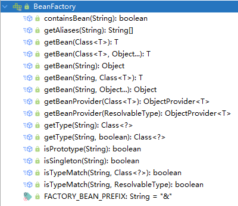

# Spring IoC 容器

> In Spring, the objects that form the backbone of your application and that are managed by the Spring IoC container are called beans. A bean is an object that is instantiated, assembled, and managed by a Spring IoC container. Otherwise, a bean is simply one of many objects in your application. Beans, and the dependencies among them, are reflected in the configuration metadata used by a container.
>
> 在Spring中，若干对象互相构成了应用的骨架，这些对象由IoC容器所管理，被称之为bean。Bean均是由Spring IoC容器所实例化、组装并管理的对象，而非单单只是应用中的某个对象。Bean以及它们之间的相互依赖关系则反映在容器所使用的配置元数据之中。

## 1 控制反转

**控制反转**（*Inversion of Control，IoC*）是Spring框架最基础的概念，IoC一般也被称为**依赖注入**（*Dependency Injection，DI*）。

在传统的Java开发中，比如有个类`A`用到了类`B`的对象`b`，一般来说，需要在`A`中显式地实例化`b`。

```java
class A {
    B b;
    A() {
        b = new B(); // 需要显式的new出B的对象。
    }
}

class B {}
```

有了IoC之后，在A中只需要定义属性b，*b的对象实例化及将b“注入”到A实例中*这个步骤，可以交由IoC框架（容器）来做，这个就叫控制反转。

>  It is a process whereby objects define their dependencies (that is, the other objects they work with) only through constructor arguments, arguments to a factory method, or properties that are set on the object instance after it is constructed or returned from a factory method. The container then injects those dependencies when it creates the bean. This process is fundamentally the inverse (hence the name, Inversion of Control) of the bean itself controlling the instantiation or location of its dependencies by using direct construction of classes or a mechanism such as the Service Locator pattern.
>
> （控制反转）是一个过程，在这个过程中的对象，只需要定义它们的依赖项，比如通过构造函数参数、工厂方法参数或是对象自身的setter方法，容器会在创建bean时注入这些依赖。这个过程是**bean自己控制依赖的实例化**或是**服务定位器模式之类的机制控制的依赖的实例化**的**反转**（因而得名，控制反转）。

## 2 Bean

Bean是由Spring IoC容器所实例化、组装并管理的对象。容器加载配置，由配置元数据创建bean。

### 2.1 BeanDefinition

在容器内部，bean的定义是以`BeanDefinition`对象的方式存在，这些对象会包含这些信息：

- 一个包限定（package-qualified）类名：一般来说是定义了bean的实际的实现类。
- Bean的行为配置元素：它阐明了这个bean在容器中的行为（比如作用域、生命周期回调等）。
- 指向当前bean所需要的其他bean的引用：依赖。
- 新创建对象的一些其他配置设置：比如池的大小限制，或是管理连接池的bean中的连接数。

这些bean的定义实际上由这些属性组成：

|           属性           |        描述        |
| :----------------------: | :----------------: |
|          Class           |        类名        |
|           Name           |  Bean的名称（id）  |
|          Scope           |       作用域       |
|  Constructor arguments   |    构造函数参数    |
|        Properties        |        属性        |
|     Autowiring mode      |    自动装配模式    |
| Lazy initialization mode |     懒加载模式     |
|  Initialization method   | 初始化（回调）方法 |
|    Destruction method    |  销毁（回调）方法  |

除了这些bean的定义信息之外，`ApplicationContext` 的实现类还允许用户将一些在容器外创建的对象（用户自己创建）注册进来。这种方式是通过访问`ApplicationContext` 的`BeanFactory`来实现的。`getBeanFactory()`方法会返回`BeanFactory`的实现类`DefaultListableBeanFactory`，它的`registerSingleton(..)`和 `registerBeanDefinition(..)` 支持这种注册操作。不过还是推荐用常规的定义bean元数据的方法来定义bean。

虽然Spring在一定程度上支持覆盖现有元数据和现有的单例，但是官方并不支持在运行时（runtime）注册新的bean（与`BeanFactory`的访问发生并发），这可能导致并发访问异常，且可有导致bean容器中出现不一致状态。

### 2.2 Bean的实例化

容器中的bean可以通过三种方式实例化：

- 构造方法
- 静态工厂方法
- 实例工厂方法

#### 2.2.1 构造方法

bean配置的默认方式就是通过调用其类的构造方法来实例化该bean：

```xml
<!-- 无参构造函数 -->
<bean id="exampleBean" class="examples.ExampleBean"/>

<!-- 根据构造函数参数类型匹配 -->
<bean id="exampleBean" class="examples.ExampleBean">
    <constructor-arg type="int" value="7500000"/>
    <constructor-arg type="java.lang.String" value="42"/>
    <constructor-arg ref="bean1"/>
</bean>

<!-- 根据构造函数参数位置匹配 -->
<bean id="exampleBean" class="examples.ExampleBean">
    <constructor-arg index="0" value="7500000"/>
    <constructor-arg index="1" value="42"/>
</bean>

<!-- 根据构造函数参数名称匹配 -->
<bean id="exampleBean" class="examples.ExampleBean">
    <constructor-arg name="years" value="7500000"/>
    <constructor-arg name="ultimateAnswer" value="42"/>
</bean>
```

#### 2.2.2 静态工厂方法

容器可以调用静态工厂方法来创建bean实例：

```xml
<bean id="clientService" class="examples.ClientService" factory-method="createInstance"/>
```

其对应的工厂类：

```java
public class ClientService {
    private static ClientService clientService = new ClientService();
    private ClientService() {}

    public static ClientService createInstance() {
        return clientService;
    }
}
```

#### 2.2.3 实例工厂方法

区别于静态工厂方法创建的实例，还支持通过实例方法来创建：

```xml
<!-- 工厂实例 -->
<bean id="serviceLocator" class="examples.DefaultServiceLocator" />

<!-- 通过实例工厂创建的bean -->
<bean id="clientService" factory-bean="serviceLocator" factory-method="createClientServiceInstance"/>
```

对应的工厂实例类：

```java
public class DefaultServiceLocator {

    private static ClientService clientService = new ClientServiceImpl();

    public ClientService createClientServiceInstance() {
        return clientService;
    }
}
```

### 2.3 Bean的作用域

默认情况下，容器创建的bean都是单例的，但是实际场景中，有些bean并不是无状态的，这种bean就不适合“一骑打天下”。

Bean的作用域控制了某个bean的定义能够创建的对象的范围。

Spring定义了多个作用域：

- `singleton` - 每个容器中单个bean的定义的范围只有单个对象实例。
- `prototype` - 单个bean的定义的范围是任意数量的对象实例。
- `request` - 在Spring Web应用上下文中，单个bean的定义的范围限定为单个http请求的生命周期。
- `session` - 在Spring Web应用上下文中，单个bean的定义的范围限定为单个http会话的生命周期。
- `application` - 在Spring Web应用上下文中，单个bean的定义的范围限定为一个`ServletContext`的生命周期。
- `websocket` - 在Spring Web应用上下文中，单个bean的定义的范围限定为一个`WebSocket`的生命周期。

### 2.4 生命周期

Spring Framework提供了一系列的接口，让开发者能够在bean的生命周期的各个节点能够执行自定义的逻辑，[官方文档](https://docs.spring.io/spring-framework/docs/current/reference/html/core.html#beans-factory-nature)将这些接口回调分为三类：

- 生命周期回调
- `ApplicationContextAware`与`BeanNameAware`通知回调
- 其他Aware接口通知回调

#### 2.4.1 生命周期回调


## 3 容器

`org.springframework.beans`包与`org.springframework.context`包是Spring IoC容器的基础，其中的[`BeanFactory`](https://docs.spring.io/spring-framework/docs/5.3.14/javadoc-api/org/springframework/beans/factory/BeanFactory.html)接口是所有IoC容器中最顶层的抽象，其定义了一些如根据名称获取bean、根据类型获取bean、是否包含某bean等容器的基础行为。



[`ApplicationContext`](https://docs.spring.io/spring-framework/docs/5.3.14/javadoc-api/org/springframework/context/ApplicationContext.html)是`BeanFactory`的子接口，在其基础上增加了一些如AOP的支持、事件的发布和特定应用的上下文等。

我们写的大多数应用都是与`ApplicationContext`打交道，`ApplicationContext`接口几乎代表了Spring IoC容器，它负责了bean的实例化、配置与组装。至于应当实例化哪些bean？bean与bean之间如何依赖、如何装配？容器可以通过读取配置的方式获取。这些配置可以是**XML文件**或是**Java代码**。

Spring提供了`ApplicationContext`接口不同的具体实现。比如：

- `FileSystemXmlApplicationContext`：基于文件系统（磁盘中的文件）的XML配置上下文
- `ClassPathXmlApplicationContext`：从`classpath`中拿XML配置的上下文
- `AnnotationConfigApplicationContext`：基于注解配置的上下文
- 等...

关于初始化启动容器，可以通过：

```java
ApplicationContext context = new ClassPathXmlApplicationContext("application-context.xml");
```

## 4 装配

容器除了负责创建bean的实例，还得负责搭建bean之间的关联关系（依赖关系）。容器这种协调bean之间关联关系的行为被称为装配（wiring）。

Spring支持多种容器装配配置，较常用的有：

- 基于XML的显式配置
- 基于注解的显式配置
- 隐式bean发现与自动装配

### 4.1 基于XML方式的显式配置

XML方式的上下文配置，是一种比较传统的，简单且直观的配置方式：

```xml
<?xml version="1.0" encoding="UTF-8"?>
<beans xmlns="http://www.springframework.org/schema/beans"
    xmlns:xsi="http://www.w3.org/2001/XMLSchema-instance"
    xsi:schemaLocation="http://www.springframework.org/schema/beans
        https://www.springframework.org/schema/beans/spring-beans.xsd">

    <bean id="bean1" class="...Bean1">  
        <!-- collaborators and configuration for this bean go here -->
    </bean>

    <bean id="bean2" class="...Bean2">
        <!-- collaborators and configuration for this bean go here -->
        <property name="bean1" ref="bean1"/>
    </bean>

    <!-- more bean definitions go here -->

</beans>
```

XML方式的配置中的bean表现为<beans/>顶层标签内部的多个<bean/>标签。其`id`属性标识了一个独特的bean，是唯一的。其`class`属性定义了bean的类型，其使用的是对应的全限定类名。

这里的`id`属性可以用作被依赖的bean的引用`ref`。如上面的例子中，对象`bean2`中用到了`bean1`对象，容器根据标签属性的定义，完成将`bean1`注入到`bean2`中。

### 4.2 基于Java代码方式的显式配置

Spring同样支持使用加在类上的注解`@Configuration`配合加在方法上的注解`@Bean`，来作为容器的配置来源。

加了`@Configuration`注解的类，表示该类主要作用是一个bean定义源，该类内部`@Bean`标签标记的方法实例化、配置、初始化了一个被容器所管理bean。简单的例子：

```java
@Configuration
public class AppConfig {

    @Bean
    public Bean1 bean1() {
        return new Bean1();
    }
}
```

其等价于：

```xml
<beans>
    <bean id="bean1" class="...Bean1"/>
</beans>
```

`@Configuration`的类同样支持其内部`@Bean`的相互依赖注入，直接调用另一个`@Bean`的方法即可：

```java
@Configuration
public class AppConfig {

    @Bean
    public Bean1 bean1() {
        return new Bean1();
    }
    
    @Bean
    public Bean2 bean2() {
        return new Bean2(bean1());
    }
    
    @Bean
    public Bean3 bean3() {
        Bean3 bean3 = new Bean3();
        bean3.setBean2(bean2());
        return bean3;
    }
}
```

Java代码方式的配置，其对应的容器启动可以通过``AnnotationConfigApplicationContext``来做：

```java
ApplicationContext ctx = new AnnotationConfigApplicationContext(AppConfig.class);
```

关于配置类的注解`@Configuration`，Spring还支持一些其他的如`@Component`的类注解配置，还有从业务层级方面定义的类配置注解如`@Service`、`@Repository`。

### 4.3 自动发现与自动注入

Spring从两个方面实现自动化装配：

- 组件扫描（component scan）：容器扫描指定package下带注解的类。
- 自动装配（autowiring）：容器自动装配被依赖的bean。

通过如下配置开启组件扫描：

```xml
<?xml version="1.0" encoding="UTF-8"?>
<beans xmlns="http://www.springframework.org/schema/beans"
    xmlns:xsi="http://www.w3.org/2001/XMLSchema-instance"
    xmlns:context="http://www.springframework.org/schema/context"
    xsi:schemaLocation="http://www.springframework.org/schema/beans
        https://www.springframework.org/schema/beans/spring-beans.xsd
        http://www.springframework.org/schema/context
        https://www.springframework.org/schema/context/spring-context.xsd">

    <!-- 扫描基于注解的配置 -->
    <context:component-scan base-package="org.example"/>
    
</beans>
```

也可以通过在配置类上加注解@ComponentScan的方式启动组件扫描：

```java
@Configuration
@ComponentScan(basePackages = {"org.example"})
public class AppConfig {
    // ...
}
```

自动装配注解`@Autowired`可以加在属性、构造方法、普通方法上，以实现自动注入：

```java
public class AutoWiredBean {
    
    @Autowired
    private Bean1 bean1;
    
    private Bean2 bean2;
    
    private Bean3 bean3;
    
    @Autowired
    public AutoWiredBean (Bean2 bean2) {
        this.bean2 = bean2;
    }
    
    @Autowired
    public void setBean3(Bean3 bean3) {
        this.bean3 = bean3;
    }
}
```

`@Autowired`还可以搭配`@Qualifier`注解来实现指定id的bean的注入：

```java
@Autowired
@Qualifier("theSpecialBean3")
public void setBean3(Bean3 bean3) {
    this.bean3 = bean3;
}
```

### 4.4 关于两种配置方式的讨论

总有人说纯Java代码的配置更优于XML方式的配置，但是这种“命题”一般都不可能是绝对的。有人喜欢纯代码方式，注解带来开发的便利性，能够很方便地定义很多“上下文”，直接“植于”代码上的注解在开发时更简洁，更精确。喜欢XML方式的人觉得这种方式在不侵入代码的同时，能够实现组件的管理，而且加了注解的类均脱离了*POJO*的范畴，还有人觉得XML方式的配置更集中，更方便控制。

当然这两种方式并不是“非A即B”，Spring支持两种方式的搭配使用。
