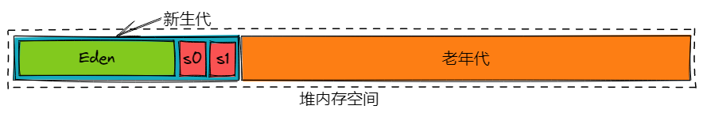
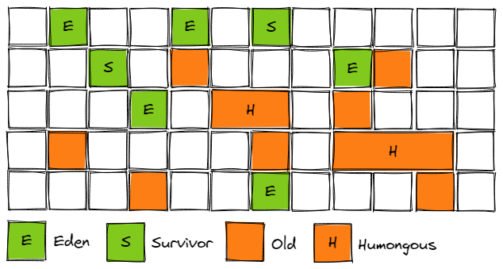

# JVM垃圾回收机制

## 概述

了解完jvm内存区域的知识，必然会引申到jvm的垃圾回收机制。**垃圾回收(Garbage Collection, GC)**，简单来讲就是清理掉jvm内存中的垃圾对象，以释放空间，更有效地利用内存。

## 如何判断垃圾

### 引用计数法

 Java中，使用一个对象必须通过引用来进行。那么是不是可以这样认为：*当一个对象没有有效的引用指向它时，这个对象差不多可以被干掉了。*那么我们给每一个对象加一个`引用计数器`，每有一处引用指向它时，计数器+1，当引用失效时，计数器-1。需要的时候，检查对象的计数器，当计数器归0时，认定当前对象为可回收。

但是，引用计数法无法解决对象的**循环引用**问题。


### 可达性分析

为了解决上面的问题，Java采用了***可达性分析***算法。其思想是，通过一系列`GC Roots`对象作为起点进行搜索，如果在`GC Roots`对象和一个对象之间没有可达路径，则认为该对象是不可达的。但是不可达对象并不等价于可回收对象，判定为不可达对象要变为可回收对象，至少需要经过两次标记过程。两次标记后仍是不可达对象的，将面临回收。


可作为GC Roots的对象包括但不限于如下几种：

1. 虚拟机栈(栈帧中的本地变量表)中引用的对象
2. 方法区中静态属性引用的对象
3. 方法区中常量引用的对象
4. 本地方法栈中引用的对象

## 垃圾回收算法

### 标记清除法

标记清除法是将垃圾清除分为两个阶段：

1. 标记：从根节点开始标记出需要回收的对象
2. 清除：清理需要回收的对象，回收空间


标记的过程采用`可达性分析算法`，这样虽然能解决循环引用问题，但是标记清除算法有明显的缺点：

- 效率低，需要两次遍历
- 清理出的空间碎片化严重

### 标记整理（压缩）法

针对标记清除法空间碎片化的缺点，有人提出了标记整理法（Mark-Compact），其标记阶段与标记清除法相同，但在标记完对象后，将所有存活的对象向内存空间的一端移动，然后直接清理掉端边界外的对象。


这样就解决了空间碎片化的特点，但是效率略低。

### 复制算法

复制算法是将内存空间划分为大小相同的两块，每次只使用其中一块内存，在垃圾回收时，将存活对象复制到另一块内存空间中，然后将当前内存空间清空，并交换两块内存角色。


很明显的，其最大的缺点就是**浪费空间**，但是它快啊，在存活对象少的情况下，复制操作少，效率高。但如果存活对象多的话，就不太合适了。

### 分代收集法

分代收集法是目前最常见的JVM垃圾回收策略，其思想是根据对象的不同生命周期将内存划分为不同的区域。一般划分为**新生代（Young Generation）**和**老年代（Tenured/Old Generation）**。新生代的特点是每次GC都会有大量对象被回收，而老年代每次GC时只有少量对象被回收。结合上述几种垃圾回收算法的各自优缺点，不同区域可以选择不同的垃圾回收算法。

新生代适合复制算法，老年代适合标记清除法或标记整理法

## 垃圾收集器

JVM目前提供了多种垃圾收集器，大部分都是分代专用的。

新生代：

- Serial
- ParNew
- Parallel Scavenge

老年代：

- CMS
- Serial Old
- Parallel Old

通用：

- G1

### Serial垃圾收集器

Serial是最基础的垃圾收集器，它是单线程的，使用的是复制算法。在垃圾收集时，程序会暂停手上所有的工作线程（STW，Stop The World），直到垃圾收集结束。不过又由于单线程没有了上下文的切换，而且对于新生代来说，一般需要复制的对象比较少（存活对象较少），所以整体上Serial算是高效的，是比较适合新生代的垃圾收集器。


### ParNew收集器

ParNew是Serial的多线程版本，除了在垃圾收集时采用多线程，其余行为均与Serial完全相同。Par是指Parallel，并行的意思，这里的多线程并不是说垃圾采集与工作线程并发，在垃圾收集时同样需要STW。

ParNew收集器会默认开启与CPU数量相同的线程数，也可以通过参数`-XX:ParallelGCThreads`来指定线程数。所以在多CPU的情况下，ParNew会比Serial效果要好，但在单CPU时，由于需要上下文切换，ParNew反而不如Serial。


相关参数：

- `-XX:ParallelGCThreads`：指定GC线程的数量，默认与cpu数量相同
- `-XX:UseConcMarkSweepGC`：强制使用CMS时，会默认使用ParNew
- `-XX:UseParNewGC`：在新生代指定使用ParNew

### Parallel Scavenge收集器

通常也被称作吞吐量收集器（Throughput Collector）。与ParNew类似，Parallel Scavenge也是使用的**复制算法**，同时GC时也是**多线程**的。与其他收集器不同的是，其是**面向吞吐量要求的（吞吐量优先）**。

> 吞吐量 = 用户代码运行时间 / (用户代码运行时间 + 垃圾回收时间)

高吞吐量就是高效地利用CPU时间，尽快地完成程序的计算任务。这适用于更关注计算任务结果，而不是存在较多交互的程序，比如批量处理、定时任务执行、复杂运算等。

相关参数：

- `-XX:MaxGCPauseMillis`：最大垃圾收集停顿时间，大于零的毫秒数
- `-XX:GCTimeRatio`：垃圾收集时间占比。指定一个1-99的整数n，则垃圾收集时间与程序工作时间的占比被设置为1:n。例*-XX:GCTimeRatio=19*，那么垃圾收集时间占整个CPU时间的1/(1+19)，即会有5%的时间会用在垃圾收集上。（这个值默认设置是99）

### Serial Old收集器

Serial Old是Serial收集器的老年代版本，是**单线程的**，使用**标记整理算法**。Serial与SerialOld的搭配如图：


### Parallel Old收集器

Parallel Old收集器是Parallel Scavenge收集器的老年代版本。使用的是**标记整理算法**，同时也是**多线程**的。与Parallel Scavenge的搭配如图：


### CMS收集器

CMS（Concurrent Mark Sweep）收集器，以获取最短回收停顿时间（STW时间）为目标。基于**标记清除法**的老年代**并发**收集器。这里的“并发”指的是在其垃圾收集过程中，某些阶段GC线程和工作线程是可以并发执行的。

CMS收集器对比上面的几个收集器，它的垃圾采集过程相对更复杂一点，共有七个步骤：

1. 初始标记 - 只是标记一下与GC Roots直接关联的对象，有STW
2. 并发标记 - 进行GC Roots的可达性追踪，与工作线程并发执行，无STW
3. 重新标记 - 修正并发标记期间有变更的对象标记记录，有STW
4. 并发清除 - 清除标记出来的不可达对象，与工作线程并发执行，无STW

由于最耗时的并发标记和并发清除是与工作线程并发执行的，总体上看，CMS的停顿时间较少，交互上更友好。


关于`concurrent mode failure`，在CMS并发清理阶段，由于对象还在源源不断往老年代中生成或复制，那么便有可能出现：1. 老年代空间耗尽前，未能完成对垃圾对象的回收；2. 新的空间分配请求未能在老年代剩余空间中得到满足。便会导致concurrent mode failure，此时JVM将会以停顿的方式执行full GC（Serial Old），显然这样不太美好。

关于CMS的触发时机，[这篇博客](https://blog.csdn.net/Ryanqy/article/details/104946950)讲解地非常详细，作者扒了JVM的源码来分析了CMS的触发条件。常见的几种触发条件有：1. 基于历史CMS的运行指标统计，预测下一次CMS完成所需时间大于老年代预计填满的时间（如果是第一次CMS，没有统计数据怎么办？答案是根据老年代使用占比来判断，达到50%）；2. 老年代的空间使用占比达到阈值（92%，这个值文章中是通过源码中的公式计算出来的）。 

### 分代收集器的选择


选择垃圾收集器之前需要先分析场景：

- 如果应用程序是计算型， 重点关注计算结果，目的是快速出计算结果。那么需要选择吞吐量优先的。
- 如果应用程序是服务型的，停顿时间会影响服务质量，导致超时或是差的交互体验。那么就需要关注低停顿时间。

> **(1) 吞吐量优先的并行收集器**
> 参数配置：
> 1, `-Xmx4g -Xms4g -Xmn2g -Xss200k -XX:+UseParallelGC -XX:ParallelGCThreads=8`
> 说明：选择Parallel Scavenge收集器，然后配置多少个线程进行回收，最好与处理器数目相等。
>
> 2，`-Xmx4g -Xms4g -Xmn2g -Xss200k -XX:+UseParallelGC -XX:ParallelGCThreads=8 -XX:+UseParallelOldGC`
> 说明：配置老年代使用Parallel Old
>
> 3，`-Xmx4g -Xms4g -Xmn2g -Xss200k -XX:+UseParallelGC -XX:MaxGCPauseMills=100`
> 说明：设置每次年轻代垃圾回收的最长时间。如何不能满足，那么就会调整年轻代大小，满足这个设置
>
> 4，`-Xmx4g -Xms4g -Xmn2g -Xss200k -XX:+UseParallelGC -XX:MaxGCPauseMills=100 -XX:+UseAdaptiveSizePolicy`
> 说明：并行收集器会自动选择年轻代区大小和Survivor区的比例。
>
> **(2)响应时间优先的并发收集器**
> 1， `-Xmx4g -Xms4g -Xmn2g -Xss200k -XX:+UseConcMarkSweepGC -XX:+UseParNewGC`
> 说明：设置老年代的收集器是CMS，年轻代是ParNew
>
> 2，`-Xmx4g -Xms4g -Xmn2g -Xss200k -XX:+UseConcMarkSweepGC -XX:CMSFullGCsBeforeCompaction=5 -XX:+UseCMSCompactAtFullCollection`
> 说明：首先设置运行多少次GC后对内存空间进行压缩，整理。同时打开对年老代的压缩（会影响性能）
>
> —— 摘自[【JVM】垃圾收集器和收集器的选择策略](https://www.cnblogs.com/itplay/p/11378813.html)


### G1(Garbage First)垃圾收集器

自Java 7 update 4起，Java引入了新的垃圾收集器G1。G1的存在是为了取代CMS，[JSE8的手册](https://docs.oracle.com/javase/8/docs/technotes/guides/vm/gctuning/g1_gc.html)里写了：

> G1 is planned as the long-term replacement for the Concurrent Mark-Sweep Collector (CMS).

区别于已有的垃圾收集器，G1对于堆内存的分代划分不是连续的。分代收集器将堆内存划分为，新生代-老年代，新生代中又有Eden区/From Survivor区/To Survivor区，注意这里的分代的空间在物理上是连续的。



而G1将整个堆内存划分为大小相同的若干个区块（Region）。每一个区块仍然有分代的概念，但只能有一个分代身份，它必须是新生代的，否则就是老年代的。老年代中还存在一种特殊的区块`Humongous` （巨大的），当一个对象的大小超过了一个区块的一半，那么该对象会直接分配到老年代区块中，并将该老年代转变为Humongous。一个Humongous是一组连续的区块，`StartsHumongous`标记连续区块的开始，`ContinuesHumongous`标记连续区块的延续。JVM在启动时会根据堆的大小自动计算分区大小和分区数量，每个分区最小1M，最大32M，在没有特别指定的情况下，jvm期望的目标分区数量是2048。



**G1的垃圾回收阶段**大致包含了STW的Young GC和混合GC（Mixed Collection），与并发、多阶段的标记过程。

**Young GC**。在Young GC的过程中，G1会同时收集Eden区块和Survivor区块，存活的对象会从当前的区块中复制或转移至新的区块，至于新区块是属于哪个分代，这取决于对象的年龄（经历过几次Young GC仍存活），足够“老”的对象会转移到老年代区块，否则转移到Suvivor区块（同时会被包含到下一轮Young或混合GC的CSet中）。

> CSet(s)，Collection Sets，是一组区块的集合，可以理解为计划执行回收的区块集合。G1在GC时会从CSets中复制存活对象至新的区块中，来实现压缩（整理，参考标记整理法），降低堆内存的碎片化。

**混合GC**。只有在G1成功完成一次**并发标记过程**后，G1才会执行混合GC。G1在准备执行Young GC时，发现已经成功完成了一次并发标记，那么这次的Young GC会被切换为混合GC。混合GC会同时回收年轻代和老年代区块，在混合GC过程中，G1会选择性地将一些老年代区块放入计划回收集合（CSets）中（这里防止老年代区块的数量可以通过参数`-XX:G1OldCSetRegionThresholdPercent`配置），进行GC。只有在回收到足够的老年代区块后（这个过程可能经历数次混合GC），G1才会切换回Young GC。

> ```shell
> -XX:G1OldCSetRegionThresholdPercent=10 # 设置在G1混合GC中被回收的老年代区块的数量，默认是堆内存的10%
> ```

**并发标记过程**：

- **初始标记阶段（Initial marking phase）**: 标记GC Roots。该阶段建立在一次成功的Young GC的基础上。
- **根区块扫描阶段（Root region scanning phase）**: 扫描在初始标记阶段中被标记的有引用指向老年代区块的Survivor区块，并标记其引用的对象。该阶段是并发的，但必须在下次Young GC开始前结束。
- **并发标记阶段（Concurrent marking phase）**: 扫描整个堆，找到所有可达（存活）对象。该阶段也是并发的，但会被Young GC打断。
- **重新标记阶段（Remark phase）**: 完成最终的标记，会造成停顿（STW）。该阶段扫描SATB buffers，处理并发标记产生的新的对象。
- **清理阶段（Cleanup phase）**: 停顿，执行清算（手册里用的accounting，我不知道该怎么讲..）和清理RSet。accounting的过程就是识别出所有空闲区块（空闲列表）和为下一次混合GC候选老年代区块。

> RSet，Remembered Sets，记忆集。RSet是区块私有的，每个区块都有一份独立的RSet，其记录了所有指向该区块的引用。由于RSet，G1才能并发且独立地进行区块的回收，因为扫描对区块的引用只用查看RSet，否则必须扫描整个堆。G1使用写（后）屏障来记录对堆内存的变更操作，并更新RSet。

何时会触发并发标记呢？当整个堆内存的占比达到参数`InitiatingHeapOccupancyPercent`设定的比例时，会触发并发标记。该参数的默认值是45，即堆内存使用达到45%时，触发并发标记。

> ```shell
> -XX:InitiatingHeapOccupancyPercent=45 # 设置触发并发标记的堆内存占用比阈值。默认阈值是堆内存的45%
> ```

**G1的停顿（STW）**。G1在将存活对象复制至新的区块时，会造成程序的停顿，这种停顿发生在**Young GC**（只收集年轻代区块）和**混合GC**（转移年轻代和老年代）。与CMS类似，G1的标记过程也会发生停顿，发生在初始标记阶段和标记过程最后的清理阶段，其中清理阶段是部分STW部分并发的，STW的部分会识别出空区块，并决定出下一轮GC中候选的老年代区块（混合GC）。

