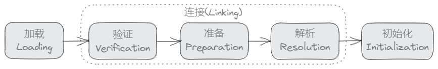
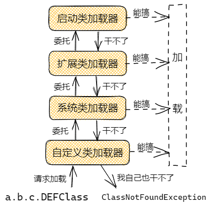

# JVM类加载机制

JVM会动态地***加载，连接，初始化***类与接口。



## 1 加载过程

### 1.1 加载

加载阶段jvm将class文件（也可能是其他途径的，比如从网络中获取、从加密文件中解密、运行时计算生成、JSP文件转换等）的类的信息加载到方法区中，然后在堆内存中生成一个`java.lang.Class`对象，作为这个类在方法区中信息的入口。

加载阶段jvm做了三件事情：

1. 通过一个类的全限定名来获取其对应的二进制流
2. 将这个二进制流表达的静态数据结构转化为jvm方法区中的运行时数据结构
3. 在堆中生成一个java.lang.Class对象，作为方法区中这个类信息的入口

> 全限定名：带包路径的类名，比如`java.lang.String`

1中为什么说是二进制流，因为被jvm加载的类信息的载体，除了最常见的class文件（包括jar包war包中的class文件）外，还可以从网络中获取（比如古董Applet）等。

### 1.2 验证

验证阶段保证了类（或接口）的二进制信息的结构的正确性，保证其能符合虚拟机的要求，不会对虚拟机带来危害。该阶段一般包含四个步骤：

1. **文件格式验证**， 验证二进制流是否符合虚拟机规范，保证其能被当前虚拟机处理，能够正确地被解析并存储于方法区中。只有通过该阶段的验证，类（接口）信息才会进入方法区中存储。后续的验证都是基于方法区中存储的类（接口）信息。
2. **元数据验证**，对类的元数据信息进行语义验证（就是对数据类型进行语法校验）。
3. **字节码验证**，进行数据流和控制流分析。（方法体中的指令码操作流程分析，保证不会做危害虚拟机的行为）
4. **符号引用验证**，在符号引用转换为直接引用的过程中，对类自身以外的信息进行匹配性校验。

### 1.3 准备

该过程为类（或接口）的静态变量分配内存并赋初始值。比如`static int a = 5;`该过程会创建`a`，并赋初始值`0`而不是`5`。

不过对于同时被`static`和`final`修饰的变量（常量），在准备阶段虚拟机会直接给其初始化为其指定的值。

Java数据类型及其初始值：

| 数据类型  |  初始值  |
| :-------: | :------: |
|    int    |    0     |
|   long    |    0L    |
|   short   | (short)0 |
|   char    | '\u0000' |
|   byte    | (byte)0  |
|   float   |   0.0f   |
|  double   |   0.0d   |
| reference |   null   |
|           |          |

### 1.4 解析

解析阶段是指将类型的常量池中的符号引用替换为直接引用的过程。

> 符号引用（Symbolic References），以一组符号来描述所引用的目标, 符号可以是任何形式的字面量,只要使用时能够无歧义的定位到目标即可。

> 直接引用（Direct References），是直接指向目标的指针、相对偏移量或是一个能间接定位到目标的句柄。

### 1.5 初始化

该阶段是加载过程的最后一步。之前在准备阶段，类的变量已经被赋过一次初始值，在这里，类变量会被赋实际值（可以理解为真正执行java代码）。除了赋值，该阶段还会执行静态语句块代码。子类的初始化会触发父类的初始化（第一个被初始化的肯定是java.lang.Object）。

初始化的契机：

- **当一个类被初始化，那么在其之前，它的父类会被初始化（如果之前未被初始化过的话）。**

- **当一个类被初始化，那么在其之前，它实现的接口中若有default方法的话，会被初始化（如果之前未被初始化过的话）。**

 ```java
 class Super {
     static { System.out.print("Super "); }
 }
 class One {
     static { System.out.print("One "); }
 }
 class Two extends Super {
     static { System.out.print("Two "); }
 }
 class Test {
     public static void main(String[] args) {
         One o = null;
         Two t = new Two();
         System.out.println((Object)o == (Object)t);
     }
 }
 ```

 *上述代码的打印结果是`Super Two false`。其中`One`类不会被初始化，由于其并未被有效（主动）地使用（没有被连接？）。此例演示了父类将在子类前被初始化。*

- **当一个接口被初始化，*不会*触发父接口的初始化。**

- **当一个静态变量被引用，只有声明它的类或接口会被初始化（常量的引用不会导致这个行为）。**
```java
class Super {
    static int taxi = 1729;
}
class Sub extends Super {
    static { System.out.print("Sub "); }
}
class Test {
    public static void main(String[] args) {
        System.out.println(Sub.taxi);
    }
}
```

*上述代码的打印结果是`1729`，因为被引用的`taxi`是在`Super`类中声明的静态变量。*

```java
interface I {
    int i = 1, ii = Test.out("ii", 2);
}
interface J extends I {
    int j = Test.out("j", 3), jj = Test.out("jj", 4);
}
interface K extends J {
    int k = Test.out("k", 5);
}
class Test {
    public static void main(String[] args) {
        System.out.println(J.i);
        System.out.println(K.j);
    }
    static int out(String s, int i) {
        System.out.println(s + "=" + i);
        return i;
    }
}
```

*上述代码的输出是*：

```
1
j=3
jj=4
3
```

*`J.i`是常量，所以不会导致`I`的初始化；*

*`K.j`不是常量，所以导致了`J`的初始化，因为接口的初始化不会触发父或子接口的初始化，所以不会导致`I`或`K`的初始化；*

参考：[Initialization of Classes and Interfaces](https://docs.oracle.com/javase/specs/jls/se8/html/jls-12.html#jls-12.4)

## 2 类加载器

类加载器的任务是上述的“加载阶段”。JVM提供了三个类加载器：

### 2.2 启动类加载器（Bootstrap）

启动类加载器也叫根类加载器，它是用来加载Java的核心类，由C++实现，不继承java.lang.ClassLoader。负责加载`$JAVA_HOME/lib`下的核心类库，或是`-Xbootclasspath`参数指定的路径下的类库。

### 2.3 扩展类加载器（Extention）

`sun.misc.Launcher$ExtClassLoader`类，由Java实现。负责加载`$JAVA_HOME/lib/ext`下的类库，或是环境变量`java.ext.dir`指定路径下的类库。

### 2.4 系统类加载器（Application）

也称应用类加载器，是`sun.misc.Launcher$AppClassLoader`类，由Java实现。负责加载JVM启动参数`-classpath`或环境变量`java.class.path`指定路径下的类库，即是我们常说的**classpath**，我们开发过程中编写的类一般都由它来加载。可以通过`ClassLoader.getSystemClassLoader()`来获取到该类加载器。

## 3 双亲委派模型

如果一个类加载器收到了加载类的请求，它先不会加载该类，而是将这个请求委托给父类加载器去执行，如果父类加载器仍有其父类加载器，则进一步向上委托。如果父类加载器可以完成类加载请求，则成功加载后返回；否则由子类加载器去尝试加载。



双亲委派模型的优势：

- 具备有优先级的层次关系，这种层次关系可以避免类的重复加载，如果一个类被父类成功加载，那么子类就不需要再加载一遍
- 安全性考虑，如果用户打算加载带有恶意代码的类，比如重写了`java.lang.Integer`类，通过双亲委派模型向上委托到启动类加载器，发现已经加载过该类，便直接返回了
