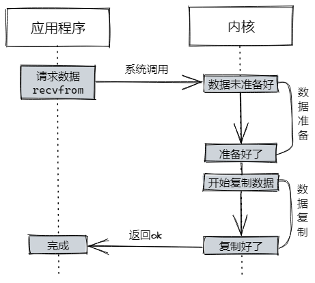
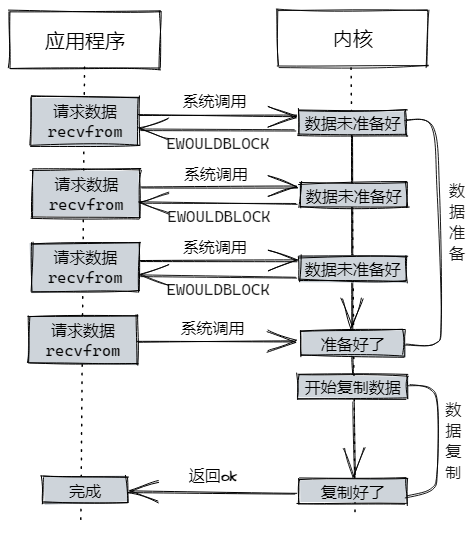

# Java IO 模型

## 1 阻塞与非阻塞，同步与异步

我们先来理解一下“阻塞/非阻塞”和“同步/异步”的概念

### 1.1 阻塞与非阻塞（blocking/non-blocking）

阻塞io会在请求后会一直等待当前请求操作完成，等待期间阻塞后续请求。非阻塞io在请求后能立刻拿到一个结果（即使操作未完成），后续仍可以尝试请求，直至拿到ok的结果。

比方说你去食堂窗口排队吃饭，排到你点好菜后，**阻塞**就是你需要在窗口那一直等着，直到师傅把饭菜打好给你，后面的同学才能点菜。**非阻塞**是你到旁边等着，后面同学继续点菜，期间你不断去窗口问师傅我的饭好没好，直到你拿到自己的饭。

### 2.2 同步与异步（synchronous/asynchronous）

与阻塞io一样，同步io在请求后会一直等待操作完成。异步io在请求后会立刻返回，此后你就不用管了，内核将操作（数据准备）好后通知你。

同样是食堂窗口点菜，**同步**需要你站在窗口那等饭菜打好。**异步**是你点好菜后可以找个位置坐下，等饭菜准备好后师傅会叫你。

非阻塞与异步的区别。非阻塞在数据未准备好的时候不会阻塞进程，但在数据准备好后，拷贝数据的过程还是阻塞的。异步在整个过程中都不会阻塞，数据准备好后，内核会将数据复制到进程（应用）中，然后才通知你。等于是非阻塞操作在饭菜准备好后，需要你自己从窗口把饭菜端到位置上吃，而异步操作里食堂师傅会把饭菜直接端到你位置上，并叫一声在玩手机的你可以吃饭了。

## 2 一次read io的典型流程

在一次read io中，数据会先被复制到操作系统内核缓冲区，然后再从内核缓冲区中复制到应用程序内存空间。这是明显的两个阶段：

1. 等待数据的准备。比如网络io中，等待分片的数据都到达，然后复制到内核缓冲区中。
2. 将数据从内核缓冲区中复制到应用程序内存空间。

## 3 几种网络io模型

基于上面的两个阶段，目前网络io模型大致分为这五种：

1. 阻塞IO（blocking io）
2. 非阻塞IO（non-blocking io）
3. 多路复用IO（multiplexing io）
4. 信号驱动IO（signal-driven io）
5. 异步IO（asynchronous io）

前4个都属于同步IO（synchronous io）。

### 3.1 阻塞IO

阻塞io的一次read操作大致如下：

程序发起`recvfrom`这个系统调用，内核开始第一个阶段：准备数据。比如udp连接，内核需要等待网络传过来的数据，凑够一个udp包。此时程序进程这边是一直阻塞的，等内核准备好数据，并复制到程序内存中，才返回结果，程序才解除阻塞状态。其对于应用程序来说数据准备阶段和数据复制阶段都是阻塞的。

### 3.2 非阻塞IO

非阻塞io的一次read操作大致如下：

程序发起`recvfrom`系统调用，内核开始准备数据，并立刻返回一个`EWOULDBLOCK`（Linux错误码，Operation would block）。对于程序来说，发起的read操作立刻得到了结果，没有发生阻塞，只不过数据没有准备好。此后应用程序可陆续发起`recvfrom`，直到内核数据准备好后，内核复制数据，复制好后返回ok。对于应用程序来说，只有数据复制阶段是阻塞的。

