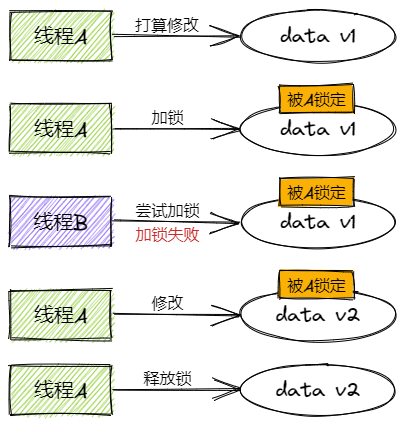
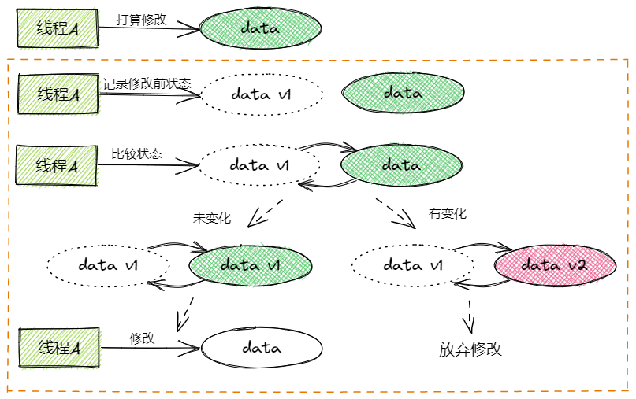

# Java锁

## 1 乐观锁与悲观锁

乐观锁与悲观锁只是广义上的锁的概念，并非具体的锁的实现。二者概念上的区别在于对待操作同步资源时对于竞争的态度。

悲观锁认为当前线程在修改某个数据时，一定会有别的线程也来修改这个数据，所以会给修改的过程枷锁，保证别的线程无法同时修改该数据。



而乐观锁认为当前线程在修改数据时，不太可能有别的线程过来同时修改，所以我不打算加锁，我只是在更新该数据前，判断数据是否发生了变化，若没有变，说明当前只有我在操作，就把数据更新掉，否则的话说明数据被别的线程修改了，再决定报错或是重来一遍。（下图虚线框中的操作需要保证原子）



悲观锁在Java中的应用有`sychronized`和`ReentrantLock`，乐观锁的应用有`AtomicInteger`等原子类（`java.util.concurrent.atomic`包）。`AtomicInteger`主要是使用了**CAS**技术来实现原子新增的。

CAS全称 Compare And Swap（比较与交换），是一种无锁算法。旨在不加锁的情况下（无阻塞）来实现多线程间的变量同步。CAS算法涉及三个变量：

- 需要进行读写的变量V
- 进行比较的值A
- 打算写入的值B

*当且仅当V的值等于A时，才允许用B来更新V的值。*这个比较+更新是一个**原子操作**，一般借助CPU指令完成。若比较时不相等，一般会采取重试操作。

 `AtomicInteger`的自增函数`incrementAndGet()`中，使用的是`unsafe.getAndAddInt()`（`Unsafe`类是类似于C语言一样操作内存空间，其只是在JDK的某些地方用的，官方并不推荐开发者直接使用）。

```java
// ----------AtomicInteger----------
public final int incrementAndGet() {
    return unsafe.getAndAddInt(this, valueOffset, 1) + 1;
}

// ----------Unsafe.class(反编译)----------
public final int getAndAddInt(Object var1, long var2, int var4) {
    int var5;
    do {
        var5 = this.getIntVolatile(var1, var2);
    } while(!this.compareAndSwapInt(var1, var2, var5, var5 + var4));

    return var5;
}
```

其先获取想要操作的内存地址上的值，`compareAndSwapInt()`借助底层的原子操作，比较内存地址上的值与预期的值是否相等，若相等则将该内存地址上的值替换为该值加1，并返回原来的值。若不相等，则重新获取该内存地址上的值，再`compareAndSwapInt`()，如此循环，直至替换成功。

CAS虽然对比锁机制更高效，但仍然存在一些问题：

- **ABA问题**。CAS在比较时，会拿修改前的值与当前值对比，比如修改前的值是A，现在也是A，就可以更新成功。但若在这期间有另一个线程将其更新为了B，又将其更新为了A，这样也能更新成功，这就有问题了。解决办法是给值加上版本号，每次更新把版本号加一。
- **循环开销问题**。若CAS一直不能更新成功，它就会一直在那自旋，浪费CPU资源。解决办法是给自旋次数设置上限，自旋次数达到上限后，挂起线程。

## 2 自旋锁与适应性自旋锁

线程的上下文切换是消耗CPU资源的，如果持有锁的线程能够在短时间内释放资源，那么竞争该资源的其他线程在获取锁失败后，不进入阻塞挂起状态，它们只需要等一等（自旋），等资源释放后立刻获取锁。这样用自旋的小消耗来换上下文切换的大消耗。

但是自旋锁本身并不能代替阻塞，自旋锁只是用自旋的消耗来替代上下文切换的消耗，若自旋的消耗更大的话（持有锁的线程长时间占有锁导致较长的自旋时间），就非常不划算了。

所以自旋必须有个限度，给自旋锁限定一个次数上限，若自旋次数达到上限后仍未获得锁，就挂起线程。

> -XX:PreBlockSpin=10 // 设置自旋次数上限10次

JDK1.6引入了适应性自旋锁，其自旋的次数不在固定，**由前一次在同一个锁上的自旋时间及锁的拥有者的状态来决定**。对于同一个锁对象，如果短时间内有成功通过自旋获取到锁，且目前持有者正在运行，那么就认为下一次自旋很可能成功，允许其自旋更多次数。但若这个锁对象很少有通过自旋获取到锁，便可以认为下一次自旋不太可能成功，就直接放弃自旋，进入阻塞状态。

## 3 无锁、偏向锁、轻量级锁、重量级锁

这四种锁指的是锁的几种状态。

我们先从“对象头”讲起，什么是“对象头”？通过前面的讲的，我们现在知道了synchronized锁是悲观锁，我们在操作同步资源之前，会先将同步资源加锁，这个锁就是加在同步资源的对象头上。对象头主要包括两部分数据：**Mark Word（标记字段）**、**Klass Pointer（类型指针）**。

- **Mark Word（标记字段）**：无锁时默认存储的是对象的hashCode、分代年龄及锁标志位信息。这里存储的内容会随着锁状态的变化而变化。
- **Klass Pointer（类型指针）**：存储着指向方法区中对象对应类信息的指针。

|  锁状态  |                                          Mark Word (64 bits) |
| :------: | -----------------------------------------------------------: |
|   无锁   | 对象hashCode、分代年龄、是否是偏向锁biased_lock(0)\|锁标志位lock(01) |
|  偏向锁  | 偏向线程ID、偏向时间戳epoch、对象分代年龄、是否是偏向锁biased_lock(1)\|锁标志位lock(01) |
| 轻量级锁 |                   指向（栈中）锁记录的指针\|锁标志位lock(00) |
| 重量级锁 |          指向重量级锁（monitor对象）的指针\|锁标志位lock(10) |

### 3.1 重量级锁、monitor

在JVM中，每一个对象都有一个对应的monitor（监视器锁），在javap反编译字节码的信息中我们能看到同步语句块的实现是使用`monitorenter`和`monitorexit`指令（对于同步方法，jvm只是给方法信息做了个同步标识`ACC_SYNCHRONIZED`，隐式地操作monitor的进出）。当执行`monitorenter`指令时，当前线程会尝试获取锁对象对应的monitor的所有权，若monitor的计数器为0，那么线程将成功获取monitor的所有权，并将monitor的计数器记为1。若当前线程已经持有了该monitor，再执行`monitorenter`时，将monitor计数器加1（可重入锁）。若当前monitor已被其他线程占有，则进入阻塞状态，直到该monitor的计数器变为0，再尝试重新获取monitor的所有权。

执行`monitorexit`的线程必须是该monitor的所有者，执行后将monitor的计数器减1，若减1后计数器变为0，该线程则退出该monitor，放弃所有权，其他阻塞的线程开始尝试获取所有权。

这种方式的加锁就是**重量级锁**，被锁的锁对象的`Mark Word`中存储了指向了对应monitor的指针。除了当前获取到锁的线程，所有等待锁的线程都会被挂起（进入阻塞状态）。

在JDK1.6以前，`synchronized`的底层实现是简单粗暴地直接用monitor来做的，阻塞和唤醒线程的开销可能比同步块内的代码执行的开销还要大，效率低下。为了优化，JDK1.6中引入了“偏向锁”和“轻量级锁”。锁状态的级别从低到高依次是无锁、偏向锁、轻量级锁、重量级锁，有锁的状态（后三个）只能升级不能降级。

### 3.2 轻量级锁

区别于重量级锁，轻量级锁状态时，所有等待的线程**不会**进入阻塞状态，取而代之的是通过自旋的形式尝试获取锁，减少了线程阻塞与唤醒的开销。

轻量级锁加锁步骤：

1. 代码执行到同步块，若锁对象的Mark Word中的锁标志位是"01"的话，JVM会在当前线程的栈帧中创建一条名为**lock**的记录（锁记录lock record）。这个记录用来存储当前锁对象的Mark Word的拷贝，官方称之为**Displaced Mark Word**。
2. CAS操作尝试将锁对象的Mark Word替换为锁标志位"00"与指向lock record的指针。
3. 若操作成功，则加锁成功，当前线程持有锁。
4. 若操作失败，JVM先检查当前线程是否已经持有该锁，若是则直接进入同步块执行代码。否则说明存在竞争，有其他线程抢先占有了该锁，此时**轻量级锁将会膨胀为重量级锁**。

轻量级锁解锁步骤：

1. CAS操作将Mark Word替换为锁记录lock record中存储的加锁前的Mark Word内容。
2. 替换成功，结束。
3. 替换失败，说明在持有锁期间有其他线程尝试获取锁并失败，将锁膨胀为了重量级锁，这样的话就执行释放锁。

*参考：[JAVA Introduction to lightweight lock](https://www.iodraw.com/en/blog/200844756)*

### 3.3 偏向锁

线程在占有monitor的过程中通常会伴随着多次CAS操作（轻量级锁的过程），这会带来不小的本地延迟。对于无竞争的场景来说，这部分操作就有些多余（HotSpot偏向锁的作者讲，大部分的锁对象在其生命周期中只会被同一个线程持锁）。偏向锁的引入就是为了减少这部分的开销的。

当线程执行到同步块时，获取到锁后，会在锁对象的Mark Word里存储偏向线程ID（当前线程ID）。当线程再次需要获取锁的时候，它不再需要CAS操作来加锁和释放锁，而是先去检查该锁对象的Mark Word中是否有指向当前线程的偏向线程id，若有，则说明已经获得锁，若无，再判断下偏向锁标识，若是无锁状态，则CAS尝试设置偏向线程id，成功的话则加锁成功。

线程不会主动释放偏向锁，若没有竞争的话，锁对象的Mark Word会一直偏向于该线程。当发生竞争时，会引起偏向锁的撤销，偏向锁的撤销需要等待“安全局点Safe Point（在这个节点上没有字节码在运行）”，然后暂停拥有偏向锁的线程，判断：

1. 偏向线程未持有该锁（偏向线程死亡或偏向线程栈中lock record未找到该锁），允许重偏向的则该锁变为可偏向锁，否则撤销为无锁。（重偏向没搞懂。。）
2. 偏向线程正在持有该锁，偏向锁升级为轻量级锁。

*偏向锁的撤销参考：[源码解析-偏向锁撤销流程解读](https://www.jianshu.com/p/7445361e187f)*

JDK1.6以后，偏向锁是默认开启的，也可以通过JVM参数`-XX:-UseBiasedLocking=false`来关闭它。值得一提的是，在JDK15中，hotspot干掉了偏向锁：[JEP 374: Disable and Deprecate Biased Locking](https://openjdk.java.net/jeps/374)

(有空再看：[Synchronization - Synchronization - OpenJDK Wiki ](https://wiki.openjdk.java.net/display/HotSpot/Synchronization))

### 3.4 无锁

无锁状态也是对象的平常的状态，没有线程对它锁定，一个无锁状态的对象能够被所有的线程访问且修改。

无锁状态下的对象也能做到安全地共享，比如上面讲的CAS，线程不断地尝试修改共享对象，若有版本冲突则继续重试，直到修改成功退出。但要做到保证原子，同一时刻只有一个线程能够修改成功。

## 4 公平锁与非公平锁

**公平锁**：所有线程按照申请锁的顺序依次等待获取锁，存在一个排队队列，下一个获取到锁的线程是队列的第一位。

- 优点：所有线程都能获取到锁，不会饿死在队列中
- 缺点：吞吐量的不足，除了第一个线程，其余线程都会阻塞

**非公平锁**：线程在申请锁的时候，会尝试直接去获取锁，有可能会直接获取成功，获取不到的话进入等待队列。

- 优点：提高吞吐量，减少线程的唤醒开销
- 缺点：可能会有线程一直获取不到锁，在队列中饿死

## 5 可重入锁与非可重入锁

这里的可重入是指一个线程在已经进入了一个同步块或方法（已经获取到锁）的情况下，能否再次进入被**同一把锁**控制的另一个同步块或方法。比如对当前方法的递归调用场景。

举个例子：

```java
public synchronized void method() {
    ...
    method();
}
```

上面的代码中，对于可重入锁来说，线程进入`method()`方法后，允许再次递归调用`method()`。假如是非可重入锁的话，线程就会在`method()`方法内部执行到递归调用时发生阻塞（这一阻塞就是个死锁）。

在JDK中，`ReentrantLock`和`synchronized`都是可重入锁，可重入锁在一定程度上可以避免死锁的发生。

## 6 共享锁与独占锁

独占锁：每次只能有一个线程访问共享资源，它以独占式的方式占有锁，在其持有锁期间，所有其他线程均不能对共享资源进行访问。

共享锁：允许多个线程同时获取锁，并发时多个线程均能访问共享资源。比如`ReadWriteLock`中的读锁，允许同一时间多个线程对一个资源的读操作。

