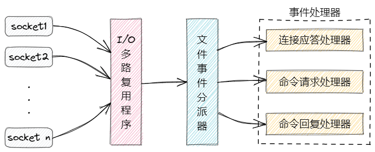

# Redis线程模型

*参考于：[Redis 和 Memcached 有什么区别？- Redis的线程模型](https://doocs.gitee.io/advanced-java/#/./docs/high-concurrency/redis-single-thread-model)*

Redis的核心是一个叫**文件事件处理器（File Event Handler）**，这个东西是个单线程的，所以大家才说Redis是单线程的模型。

单线程有什么好处呢？一是可以轻易地实现操作的原子性（Redis的每一个命令的执行都是原子的）， 而是没有共享资源的同步问题（竞争问题），三是没有了上下文切换的开销，更高效。

单线程执行，不浪费CPU资源吗？对于Redis来说，CPU一直都不是Redis的性能瓶颈，纯内存的操作使得Redis效率非常高，系统的性能瓶颈主要在网络IO上（所以Redis 6.0开始引入了多线程，对网络IO的处理进行并发操作，以进一步提升Redis的性能）。

话题回到文件事件处理器，这个东西的结构包含了四个部分：

- 多个socket连接
- IO多路复用程序
- 文件事件分派器
- 事件处理器
  - 连接应答处理器
  - 命令请求处理器
  - 命令回复处理器

