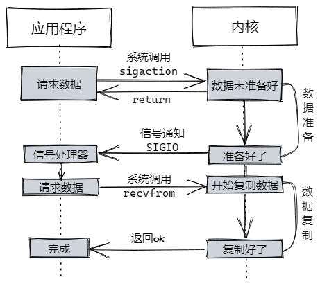
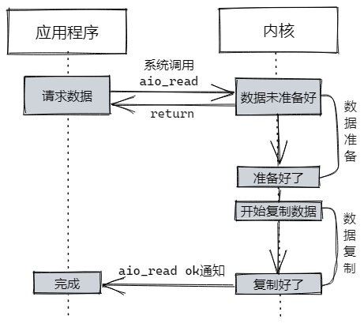

# Java IO 模型

## 1 阻塞与非阻塞，同步与异步

我们先来理解一下“阻塞/非阻塞”和“同步/异步”的概念

### 1.1 阻塞与非阻塞（blocking/non-blocking）

阻塞io会在请求后会一直等待当前请求操作完成，等待期间阻塞后续请求。非阻塞io在请求后能立刻拿到一个结果（即使操作未完成），后续仍可以尝试请求，直至拿到ok的结果。

比方说你去食堂窗口排队吃饭，排到你点好菜后，**阻塞**就是你需要在窗口那一直等着，直到师傅把饭菜打好给你，后面的同学才能点菜。**非阻塞**是你到旁边等着，后面同学继续点菜，期间你不断去窗口问师傅我的饭好没好，直到你拿到自己的饭。

### 2.2 同步与异步（synchronous/asynchronous）

与阻塞io一样，同步io在请求后会一直等待操作完成。异步io在请求后会立刻返回，此后你就不用管了，内核将操作（数据准备）好后通知你。

同样是食堂窗口点菜，**同步**需要你站在窗口那等饭菜打好。**异步**是你点好菜后可以找个位置坐下，等饭菜准备好后师傅会叫你。

非阻塞与异步的区别。非阻塞在数据未准备好的时候不会阻塞进程，但在数据准备好后，拷贝数据的过程还是阻塞的。异步在整个过程中都不会阻塞，数据准备好后，内核会将数据复制到进程（应用）中，然后才通知你。等于是非阻塞操作在饭菜准备好后，需要你自己从窗口把饭菜端到位置上吃，而异步操作里食堂师傅会把饭菜直接端到你位置上，并叫一声在玩手机的你可以吃饭了。

## 2 一次read io的典型流程

在一次read io中，数据会先被复制到操作系统内核缓冲区，然后再从内核缓冲区中复制到应用程序内存空间。这是明显的两个阶段：

1. 等待数据的准备。比如网络io中，等待分片的数据都到达，然后复制到内核缓冲区中。
2. 将数据从内核缓冲区中复制到应用程序内存空间。

## 3 几种网络io模型

基于上面的两个阶段，目前网络io模型大致分为这五种：

1. 阻塞IO（blocking io）
2. 非阻塞IO（non-blocking io）
3. 多路复用IO（multiplexing io）
4. 信号驱动IO（signal-driven io）
5. 异步IO（asynchronous io）

前4个都属于同步IO（synchronous io）。

### 3.1 阻塞IO

阻塞io的一次read操作大致如下：


程序发起`recvfrom`这个系统调用，内核开始第一个阶段：准备数据。比如udp连接，内核需要等待网络传过来的数据，凑够一个udp包。此时程序进程这边是一直阻塞的，等内核准备好数据，并复制到程序内存中，才返回结果，程序才解除阻塞状态。其对于应用程序来说**数据准备阶段和数据复制阶段都是阻塞的**。

一份典型的阻塞io代码：

```java
Socket socket = new Socket("127.0.0.1", 8080);
InputStream in = socket.getInputStream();
byte[] buffer = new byte[1024];
in.read(buffer);
```

这里的`in.read(buffer)`在等待数据时是阻塞的。当有多个连接时，每个连接都要对读操作单独开一个线程。连接数量大就懵逼了。

### 3.2 非阻塞IO

非阻塞io的一次read操作大致如下：


程序发起`recvfrom`系统调用，内核开始准备数据，并立刻返回一个`EWOULDBLOCK`（Linux错误码，Operation would block）。对于程序来说，发起的read操作立刻得到了结果，没有发生阻塞，只不过数据没有准备好。此后应用程序可陆续发起`recvfrom`，直到内核数据准备好后，内核复制数据，复制好后返回ok。对于应用程序来说，**只有数据复制阶段是阻塞的**。

JDK1.4以后提供了`java.nio`包，其中实现了以`Channel`为基础的非阻塞io，一份简单的非阻塞io代码如下：

```Java
SocketChannel channel = SocketChannel.open(new InetSocketAddress("127.0.0.1", 8080));
channel.configureBlocking(false);
ByteBuffer buffer = ByteBuffer.allocate(1024);
channel.read(buffer);
```

这里的`SocketChannel.configureBlocking(false)`将io设置为**非阻塞模式**。`channel.read(buffer)`会立刻返回一个`int`，无数据的话返回0。

### 3.3 多路复用IO

试想一下，如果我们想要解决n个连接n个线程的问题，阻塞io肯定是做不到了，但有了非阻塞io，我们能做些什么？如果我们有个n个连接的read场景，是不是可以这样做：

1. 搞一个`SocketChannel`集合，每新建一个连接（`channel`），就把它放到集合中，这个操作是可以在一个线程中做的。
2. 不断遍历这个集合，执行每个`channel`的`channel.read(buffer)`，处理成功`read`到的`buffer`，这样所有连接的读操作只用一个线程就可以完成。

但是这样有个明显的问题：当需要遍历的集合很大时，每次遍历将会非常缓慢。

Linux底层支持io多路复用（jdk的io多路复用也是基于linux底层函数实现的）。其通过一种机制，监视多个*文件描述符*(内核利用文件描述符来访问文件，可以理解为某文件的索引)，一旦某个描述符就绪（可读或可写），通知应用程序执行对应的读写操作。相关的函数有`select`、`poll`、`epoll`。

`select`函数简述：监视等待多个描述符的属性变化。程序调用`select`，linux将描述符集合从用户态复制到内核态，并在内核遍历所有描述符。能够监视的描述符数量有限制，一般为1024。由于存在复制与轮询检查，描述符数量越多，性能越差。

`poll`函数简述：与`select`函数基本一样，区别在于`poll`没有文件描述符数量限制。同样其性能也与文件描述符数量线性相关。

`epoll`函数简述：文件描述符的用户态至内核态的复制只有一次。用户注册需要监视的文件描述符，当某文件描述符就绪时，内核通过**回调机制**，在用户再次调用时，得到通知。`epoll`同样没有文件描述符数量限制，但其性能不会随描述符的数量增长而下降。`epoll`不需要轮询整个文件描述符集合，通过回调函数，就绪的文件描述符会被放入就绪的集合中，只需要遍历就绪的集合就行了。

*详细参考：[Linux I/O多路复用](https://www.linuxprobe.com/linux-io-multiplexing.html)*

JDK的多路复用io（`Selector`）的实现就是基于linux底层的函数，不同版本的jdk，使用的linux函数可能不同，常见的是`epoll`。（老版本的jdk可能用的是`select`或`poll`）

一份典型的Java多路复用io写法：

```java
Selector selector = Selector.open();
channel.configureBlocking(false); // channel必须设置为非阻塞
SelectionKey readKey = channel.register(selector, SelectionKey.OP_READ);// 注册“读”事件
readKey.attach(channel); // 将channel“附加”在key上，可通过key.attachment()直接拿到channel

while(selector.select() > 0) {
    Iterator<SelectionKey> iterator = selector.selectedKeys().iterator();
    while (iterator.hasNext()) {
        SelectionKey key = iterator.next();
        if (key.isReadable()) {
            // 处理读就绪的key
        } else if (key.isWritable()) {
            // 处理写就绪的key
        } else if (key.isAcceptable()) {
            // 处理server可接收的新连接的key
        } else if (key.isConnectable()) {
            // 处理可连接就绪的key
        }
        iterator.remove(); // Selector的就绪集合需要自己移除，以便下一轮Selector将新的就绪key放进去。
    }
}
```

​	`selector.select()`是阻塞的，只有在至少有一个就绪事件时，`select()`方法才会返回。`selectedKeys()`返回的就绪key集合，在每个就绪key处理完毕后，需要自己从集合中移除，Selector本身并不会做移除操作。

### 3.4 信号驱动io

应用程序向内核发起系统调用（`sigaction` ），该调用会立刻返回，不阻塞。在数据准备好后，内核向应用程序发起信号通知（`SIGIO` ），应用程序收到后即从内核复制数据，复制过程阻塞。



整个过程中，数据准备阶段是非阻塞的，应用程序在请求完成后就可以做自己的事情。应用程序接收到数据就绪信号后，复制过程是阻塞的。

### 3.5 异步io

应用程序向内核发起系统调用（`aio_read`）立刻收到返回，不阻塞。内核等待数据（准备数据），数据就绪后，内核负责复制过程，等数据复制好后，通知应用程序io结束。



异步 IO 与信号驱动 IO 的区别在于，异步 IO 的信号是通知应用进程 IO 完成，而信号驱动 IO 的信号是通知应用进程可以开始 IO（开始复制）。
