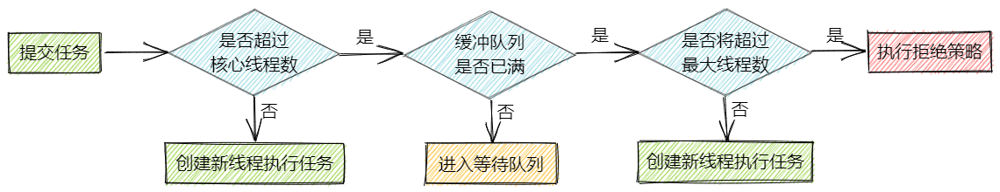
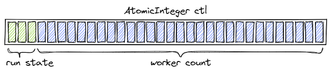
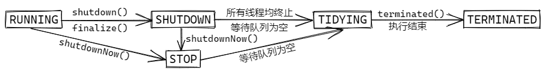
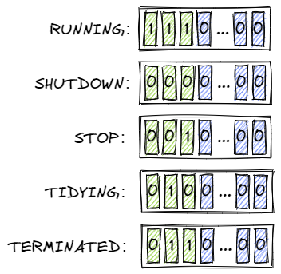

# Java线程池

创建和销毁线程的成本是非常高的，频繁地创建和销毁线程会对应用造成很大的负担，无限制地创建线程更有可能造成应用的崩溃。为了解决这俩问题：1. 创建和销毁线程的开销；2. 管理线程的数量。JDK提供了线程池技术。

## 1 ThreadPoolExecutor类

`java.util.concurrent.ThreadPoolExecutor`类是线程池技术的核心类，其主要参数有：

- `corePoolSize` - 核心线程数量
- `maximumPoolSize` - 最大线程数量
- `keepAliveTime` - 线程存活保持时间
- `unit` - `keepAliveTime` 的单位
- `workQueue` - 任务队列（缓冲队列）
- `threadFactory` - 线程工厂
- `handler` - `RejectedExecutionHandler`，拒绝策略

### 1.1 `corePoolSize` - 核心线程数量

当你向线程池提交一个任务，如果当前线程池中的线程数量小于`corePoolSize`，那么即使此时线程池中有空闲线程，线程池也会帮你创建一个线程。当然还有一种情况是调用了`prestartAllCoreThreads()`或者`prestartCoreThread()`方法，顾名思义，线程池会与先帮你创建`corePoolSize`个线程或一个线程。

### 1.2 `maximumPoolSize` - 最大线程数量

表示在线程池中能创建多少个线程。当你向线程池提交一个任务，如果当前线程池中的线程数量大于等于`corePoolSize`，且小于等于`maximumPoolSize`，且没有空闲线程时，线程池才会新创建线程。若线程池中的线程数量已达到`maximumPoolSize`的话，且当前没有空闲线程时，新提交的任务会被放置在缓冲队列（`workQueue`）中。

### 1.3 `keepAliveTime`与`unit`  - 线程存活保持时间及单位

当线程池中线程的数量大于`corePoolSize`时，若某个空闲线程的空闲时间超过 `keepAliveTime`的话，线程池会尝试shutdown它（调用其`interrupt()`方法）。

在默认情况下，线程池只会shutdown超出核心线程数量的空闲线程，对于核心线程数量内的线程，即使是空闲的也不会管它。

但线程池提供了一个 `allowCoreThreadTimeOut(boolean value)`方法，当`allowCoreThreadTimeOut(true)`时且 `keepAliveTime`大于0的话，线程池也会关闭核心线程数量内的超时空闲线程。

### 1.4 `workQueue` - 任务队列

一个阻塞队列，用于缓存等待执行的任务。

### 1.5 `threadFactory` - 线程工厂

用于创建新线程。默认的线程工厂`java.util.concurrent.Executors.DefaultThreadFactory`采用的是`new Thread()`的方式创建线程，线程的名称格式是"pool-线程池序号-thread-线程序号"。

### 1.6 `handler` - `RejectedExecutionHandler`拒绝策略

当线程池线程数量已满，且任务队列已满的情况下，新提交的任务会走设置的拒绝策略。存在四种拒绝策略：

- `ThreadPoolExecutor.AbortPolicy` - 直接丢弃新提交的任务，并抛出`RejectedExecutionException`异常。**该策略是默认的拒绝策略**
- `ThreadPoolExecutor.CallerRunsPolicy` - 将新提交的任务交由于提交任务的线程（调用`.execute()`的线程）来执行，站在该线程的角度来看，新提交的任务被同步执行了。若线程池已被shutdown，该任务会被丢弃
- `ThreadPoolExecutor.DiscardOldestPolicy` - 丢弃等待任务队列中最早的任务，并尝试重新提交该新任务。若线程池已被shutdown，该任务会被丢弃
- `ThreadPoolExecutor.DiscardPolicy` - 直接丢弃新提交的任务，不抛出任何异常（悄悄地丢弃）

## 2 线程池的种类

JDK推荐使用`java.util.concurrent.Executors`工厂类来创建线程池。常用的几种线程池有：

### 2.1 newFixedThreadPool

`Executors.newFixedThreadPool()`会创建一个指定线程数量的线程池，池中线程的存活保持时间被设置为永久。若线程池满了，新提交的任务会被放入缓冲队列（`LinkedBlockingQueue`）。若期间某线程因执行任务失败而终止，线程会创建新的线程来执行后续的任务。

### 2.2 newCachedThreadPool

`Executors.newCachedThreadPool()`创建的线程池，在其被提交任务时，若有空闲线程就复用，若无空闲线程就新建，不用关心拒绝策略（几乎不会触发拒绝策略， `maximumPoolSize`设的是`Integer.MAX_VALUE`）。**它适合执行大量短执行时间的任务**。

> These pools will typically improve the performance of programs that execute many short-lived asynchronous tasks. 
>
> 对于需要执行大量短存活时间的异步任务的应用程序来说，这种线程池通常会提高其性能。

### 2.3 newSingleThreadExecutor

`Executors.newSingleThreadExecutor()`会创建一个只有一个线程的线程池。非空闲时，新提交的任务会放入阻塞队列（`LinkedBlockingQueue`）。这个线程若是挂掉了，线程池会立刻重新创建线程以执行后续任务。这种线程池**适用于需要保证任务执行顺序的场景**，其同一个时间只有一个任务在执行。

这个工厂方法创建的线程池，使用了`FinalizableDelegatedExecutorService`包装类来保证线程池的配置不会被修改（比如增加线程数量）。

### 2.4 newScheduledThreadPool

`Executors.newScheduledThreadPool()`创建一个固定线程数量的的线程池，池中线程的存活保持时间被设置为永久。**该线程池支持定时及周期性地执行任务**。若线程池满了，新提交的任务会被放入`DelayedWorkQueue`队列。

### 2.5 几个线程池的对比

| 线程池                      | 核心线程数 | 最大线程数        | 非核心线程空闲存活时间 | 缓冲队列            |
| --------------------------- | ---------- | ----------------- | ---------------------- | ------------------- |
| newFixedThreadPool          | n          | n                 | -                      | LinkedBlockingQueue |
| newCachedThreadPool         | 0          | Integer.MAX_VALUE | 60s                    | SynchronousQueue    |
| newSingleThreadExecutor     | 1          | 1                 | -                      | LinkedBlockingQueue |
| ScheduledThreadPoolExecutor | n          | Integer.MAX_VALUE | 永久                   | DelayedWorkQueue    |

## 3 线程池执行任务的流程



## 4 线程池控制状态ctl

ctl是**线程池控制状态**，其用一个原子整型表达了两个信息：1. 有效线程数量；2. 线程池状态。

> ```
> /**
>  * The main pool control state, ctl, is an atomic integer packing
>  * two conceptual fields
>  *   workerCount, indicating the effective number of threads
>  *   runState,    indicating whether running, shutting down etc
>  *
> ```

ctl将32位的整型分割为两个部分，前3位用于表示线程池的状态，后29位用于表示有效线程数量（也就是说目前的线程池最多支持(2^29)-1个线程）。



### 4.1 线程池运行状态

JDK定义了五个线程池状态：

- **RUNNING**： 接受新提交的任务，处理缓冲队列的任务
- **SHUTDOWN**：拒绝新任务，处理缓冲队列的任务
- **STOP**：拒绝新任务，停止处理缓冲队列的任务，并尝试interrupt执行中的任务
- **TIDYING**：所有任务均被终止，有效线程数量为0，然后执行钩子函数`terminated()`
- **TERMINATED**：钩子函数`terminated()`执行结束



### 4.2 打包workerCount与runState

```java
private final AtomicInteger ctl = new AtomicInteger(ctlOf(RUNNING, 0));
private static final int COUNT_BITS = Integer.SIZE - 3;
private static final int CAPACITY   = (1 << COUNT_BITS) - 1;

// runState is stored in the high-order bits
private static final int RUNNING    = -1 << COUNT_BITS;
private static final int SHUTDOWN   =  0 << COUNT_BITS;
private static final int STOP       =  1 << COUNT_BITS;
private static final int TIDYING    =  2 << COUNT_BITS;
private static final int TERMINATED =  3 << COUNT_BITS;

// Packing and unpacking ctl
private static int runStateOf(int c)     { return c & ~CAPACITY; }
private static int workerCountOf(int c)  { return c & CAPACITY; }
private static int ctlOf(int rs, int wc) { return rs | wc; }
```

源码中五个状态（`runState`）分别分配为-1，0，1，2，3五个整数，并将其左移29位（32-3），所以其二进制表现为：



然后在`ctlOf(int rs, int wc)`方法中，与线程数（`workerCount`）做**位或运算**，这就得到了ctl，其既能表达线程池状态，又能表达有效线程数，一个**RUNNING**状态的线程池，有效线程数为**3**，那么它的**ctl**将是：


## 5 线程池缓冲队列

关于线程池缓冲队列的策略，通常由三种：

1. **直接提交（Direct handoffs）**，这是一种简单又直接的策略，比如使用`SynchronousQueue`。`SynchronousQueue`不缓冲任务，**新增操作时必须有对应的等待中的移除操作，否则会新增失败**。其容量为0，可以理解为它只做一个“传递”动作。若无线程从中消费的话，新提交任务会失败，导致新线程的创建。`SynchronousQueue`通常需要配置`maximumPoolSizes`数量为无限（`Integer.MAX_VALUE`），以免进入*拒绝策略*。
   这是execute()方法源码的一段节选：

   ```java
   // 前面是corePoolSize内的线程创建
   ...
   if (isRunning(c) && workQueue.offer(command)) {
       // 线程数超过corePoolSize时，会尝试往缓冲队列workQueue里放任务。
       // 若无空闲线程在消费workQueue（SynchronousQueue）时，
       // workQueue.offer(command)会返回false。
       ...
   }
   else if (!addWorker(command, false)) // workQueue放入失败，新增线程处理任务
       reject(command); // 新增线程失败，走拒绝策略
   ...
   ```

2. **无界队列（Unbounded queues）**，使用一个不设置容量的`LinkedBlockingQueue`，在核心线程数量的线程均busy的情况下，任务新提交的任务都会被缓存。也就是说这个线程池最多只会创建核心线程数量的线程，配置的`maximumPoolSize`将不起作用。

3. **有界队列（Bounded queues）**，典型的例子是`ArrayBlockingQueue`(`Executors`工厂类中好像未用到这个队列)。使用有界队列有助于防止应用程序的资源耗尽（在配置了有限的`maximumPoolSize`的情况下）。不过队列的大小与线程池的大小比较难把握，大队列和小池子虽然能降低负载，减少上下文切换，但是明显降低了吞吐量；但是反过来，大池子可能会导致频繁的上下文切换，吞吐量可能更差。具体的配置搭配要结合实际情况考虑。
