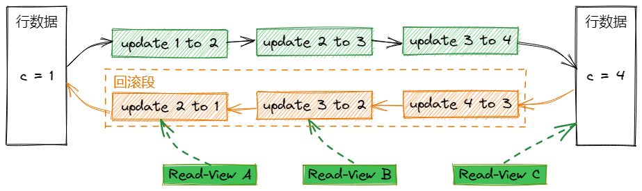

# MySQL事务

数据库事务是个老生常谈的东西。一个事务指的是一组对数据库的操作集合（序列），这组操作要么全部执行，要么全部不执行。一个事务可以看成是一个独立的、不可分割的单位。

## 1 事务的ACID

ACID是保证数据库事务正确可靠的四个特性：

- 原子性（Atomic）：一个事务中的所有操作，要么全部完成，要么全部不完成。事务中任意步骤出错，整个事务会回滚到事务初始的状态（好像事务没执行过一样）。
- 一致性（Consistency）：事务前后数据的状态是一致的，事务对数据的变更，会保证数据的完整性，符合预设的规则。比如转账前后，两个账户的金额总和是不变的。
- 隔离性（Isolation）：事务的执行是独立的，一个事务的执行不会影响另一个事务的执行。
- 持久性（Durability）：完成的事务（提交成功的），其对数据的变更是永久的。即使紧跟着系统崩溃，也不会导致数据（变更）的丢失。

## 2 隔离性与事务中的问题

我们把ACID中的'I'（隔离性）展开讲讲。要知道“隔离”实际上并不是绝对的，“隔离”的概念发生在多个事务同时执行时，绝对的“隔离”会导致低效率（需要使本应并行的事务串行执行，绝对不会互相干扰，就像Java并发中的同步锁，安全，但性能肯定跟不上）。

显然这样是没有必要的，但是允许并行执行事务，可能会导致一些问题：

### 2.1 脏读（Dirty Read）

**脏读是一个事务读取到了另一个事务未提交的内容。**图示：


图示中事务A读取到了事务B未提交的值更新（2），然后依据此值做了计算，并提交到数据库中，结果事务B却回滚了。从此破坏了数据的一致性。

### 2.2 不可重复读（Unrepeatable Read）

**不可重复读是在同一个事务中，前后两次读取到的内容不一致。**图示：


图示中事务A对c值的第二次读取，与第一次读到的值不同，原因是事务B在事务A执行期间更新了c值并提交成功。

### 2.3 幻读（Phantom Read）

**幻读是一个事务根据条件查询到的数据集，在第二次以相同条件查询到了不同的数据集。**图示：


事务A以条件`id >= 1`查询，匹配到了2行数据，事务B跟着插入了新的一行数据并提交了，事务A再次以条件`id >= 1`查询，却匹配到了3行数据。（看着与不可重复读类似？有本质区别，下面会讲到应对不可重复读的隔离级别，通过对已读到的数据记录加锁，锁不住新增的记录行。）

## 3 隔离级别

*（本节部分整理于：《[14.7.2.1 Transaction Isolation Levels](https://dev.mysql.com/doc/refman/5.7/en/innodb-transaction-isolation-levels.html)》）*

对于上述提及的几个问题，本质上是不同“隔离”程度中会发生的现象，SQL标准定义了四个隔离级别：

- 读未提交（Read Uncommitted ）
- 读已提交（Read Committed）
- 可重复读（Repeatable Read）
- 可串行化（Serializable ）

### 3.1 读未提交（Read Uncommitted ）

读未提交是最低级别的隔离，在此级别下，一个事务能够读到其他事务未提交的改动，这就导致了“脏读”现象。

### 3.2 读已提交（Read Committed）

读已提交保证了事务中能够读取到的值必须是其他事务已经提交的内容，这杜绝了“脏读”现象。这个级别下，当前事务持有了当前行的读写锁，阻止了其他事务对改行数据的读写操作。

对于*一致性读（consistent read）*，即使是同一个事务中的多次读，取的都是同一个快照中的内容。（快照是MVCC中的东西，下面讲）

> 一致性读（consistent read），读操作是基于某个时间点的数据库快照，不用担心在同一时间其他并行的事务对相同的数据做变更操作。
>
> 参见：[consistent read](https://dev.mysql.com/doc/refman/5.7/en/glossary.html#glos_consistent_read)

对于加锁读（`SELECT FOR UPDATE`或`LOCK IN SHARE MODE`）、`UPDATE`语句、`DELETE`语句，只会对指定索引行加锁，而不是用*间隙锁（gap lock）*，所以在锁定行之间是允许插入新行的（这就导致了幻读）。

> 间隙锁（gap lock），其一种加在索引记录之间的间隙上，或是加在第一行索引记录之前，或是最后一行索引记录之后的一种锁。
>
> 参见：[gap lock](https://dev.mysql.com/doc/refman/5.7/en/glossary.html#glos_gap_lock)

### 3.3 可重复读（Repeatable Read）

这个级别是**MySQL的默认隔离级别**。可重复读保证了事务从开始到结束，期间任何时候读到的数据行的内容都是一致的。

对于一致性读（consistent read），其读的是同一个事务中，第一个读操作建立的快照。同一个事务中的多个不加锁的`SELECT`语句，是互不影响的，且结果是一致的。

对于加锁读（`SELECT FOR UPDATE`或`LOCK IN SHARE MODE`）、`UPDATE`语句、`DELETE`语句，取决于语句使用的是唯一索引的唯一搜索条件，还是范围类型搜索条件。

- 对于唯一索引的唯一搜索条件，会给命中的索引记录加锁，而非给其之前的间隙加锁（间隙锁中的“加在命中的第一行索引记录之前”）。
- 对于其他的搜索条件，会给索引范围加锁。其使用的是间隙锁（gap lock）或是 *下一键锁（next-key lock）*，这种锁会阻塞其他事务将新行插入到被锁定范围的索引上。

> next-key lock，是指定索引记录的行锁与索引记录前的间隙锁的结合。
>
> 参见：[next-key lock](https://dev.mysql.com/doc/refman/5.7/en/glossary.html#glos_next_key_lock)

对于Read Committed和Repeatable Read两个隔离级别的行加锁情况，我们用例子来辅助理解，假设有这张表与表中的5行数据：

```mysql
CREATE TABLE t (a INT NOT NULL, b INT) ENGINE = InnoDB;
INSERT INTO t VALUES (1,2),(2,3),(3,2),(4,3),(5,2);
COMMIT;
```

先启动Session A，对`b=3`的行执行更新：

```mysql
# Session A
START TRANSACTION;
UPDATE t SET b = 5 WHERE b = 3;
```

再启动Session B，对`b=2`的行执行更新：

```mysql
# Session B
UPDATE t SET b = 4 WHERE b = 2;
```

作为InnoDB引擎，如果想要执行`UPDATE`语句的话，会先将读到的行加上一个排他锁（下面示例中是x-lock），然后再判断是否要修改这一行。如果不需要修改，那么会释放该行锁，如果修改了，那么这行锁会持续持有到事务结束。

对于Repeatable Read级别，Session A中的`UDPATE`会将所有行加锁，并持有到事务结束：

```
x-lock(1,2); 持有x-lock
x-lock(2,3); update(2,3) to (2,5); 持有x-lock
x-lock(3,2); 持有x-lock
x-lock(4,3); update(4,3) to (4,5); 持有x-lock
x-lock(5,2); 持有x-lock
```

在Session B中的`UPDATE`，会阻塞，直至Session A的事务提交或回滚：

```
x-lock(1,2); 阻塞等待
```

对于Read Committed级别来说，不需要修改的行会立刻释放锁，只有需要修改的行才会阻塞到事务结束， Session A：

```
x-lock(1,2); unlock(1,2)
x-lock(2,3); update(2,3) to (2,5); 持有锁x-lock
x-lock(3,2); unlock(3,2)
x-lock(4,3); update(4,3) to (4,5); 持有锁x-lock
x-lock(5,2); unlock(5,2)
```

Session B：

```
x-lock(1,2); update(1,2) to (1,4); 持有锁x-lock
x-lock(2,3); unlock(2,3)
x-lock(3,2); update(3,2) to (3,4); 持有锁x-lock
x-lock(4,3); unlock(4,3)
x-lock(5,2); update(5,2) to (5,4); 持有锁x-lock
```

### 3.4 可串行化（Serializable）

这是隔离的最高级别，在这个级别下，会互相干扰的两个事务（比如分别读写同一张表）会串行执行。

这个级别有点类似可重复读，但是如果在 [`autocommit`](https://dev.mysql.com/doc/refman/5.7/en/server-system-variables.html#sysvar_autocommit)被禁用的情况下，InnoDB会将所有普通`SELECT`语句隐式地转换为 `SELECT ... LOCK IN SHARE MODE`（这会使这条`SELECT`阻塞，直至其他事务提交，Repeatable Read级别下，普通`SELECT`读的是快照，不会阻塞。）。如果`autocommit`被启用，普通的`SELECT`语句（一致性读）读取的是自己的快照，不会为其他事务所阻塞。（如果实际场景中的确需要普通读也被阻塞的话，需要把`autocommit`关掉。）

## 4 多版本并发控制（MVCC）

*（本节部分整理于：《[14.3 InnoDB Multi-Versioning](https://dev.mysql.com/doc/refman/5.7/en/innodb-multi-versioning.html)》）*

多版本并发控制（Multi-Version Concurrency Control）。InnoDB是个多版本存储引擎，为了支持一些事务的特性，比如并发、回滚，InnoDB保留了那些发生了变更的行的历史版本。这些历史版本数据以“回滚段（rollback segment）”的数据结构存储在系统表空间和[undo表空间](https://dev.mysql.com/doc/refman/5.7/en/innodb-undo-tablespaces.html)。

“回滚段”有啥作用：

1. 根据回滚段中的信息，InnoDB可以在事务需要的时候操作回滚。
2. 回滚段信息还可以拿来构建行数据的历史版本，为一致性读使用。



上图中假设了某个值c从1陆续变更为2、3、4，那么在回滚段中就有几个对应的回滚信息。那么对于不同时刻启动的事务，就会看到不同的read-view，在图中的视图A、B、C中分别看到的值是1、2、4，同一条行数据存在着不同的版本。

在每行数据上，InnoDB增加了三个隐藏字段（是select不出来的）：

- `DB_TRX_ID`，事务id，一个6字节的字段，表示了该行上最后一次更新或插入的事务的id。当然，`DELETE`操作在内部其实是一次更新操作（行数据上还有个bit位用来标识是否被删除）。
- `DB_ROLL_PTR`：回滚指针，一个7字节的字段，其指向了回滚段中的一个undo log记录。如果该行发生了更新，那么这个undo log记录就包含了重建该行更新前状态的必要的信息。
- `DB_ROW_ID`：row id，一个6字节的字段，存放了行新增时的“单调自增”的row id。如果InnoDB需要自动创建聚簇索引，那么索引中会包含这个row id。否则的话，这个row id不会出现在任何索引中。（聚簇索引一般不是用的你建表时的主键ID嘛，如果没指定主键ID的话，那么InnoDB会使用这个隐式的row id来做聚簇索引。）

undo log在回滚段上还被区分为新增的undo log和更新的undo log。新增的undo log只有在事务需要回滚的时候用到，只要事务一提交，新增的undo log就可以立刻被丢弃。但是更新的undo log除了被用在回滚，还被用在一致性读上，只有在当前没有任何一致性读的快照，依赖于该更新updo log中的行历史版本信息的轻快下，这个undo log才能被丢弃。

所以一般建议及时的提交事务，包括那些只是一致性读的事务，不要搞长事务，否则InnoDB没法及时释放哪些更新的updo log，这会导致回滚段的持续膨胀，最终撑爆其占用的表空间。

## 5 事务的传播（Propagation）

*（参考于[Spring Transactional Propagation Isolation](https://www.baeldung.com/spring-transactional-propagation-isolation)）*

（这节放在这篇中不太合适，但是写这篇笔记的时候还未写Spring相关的东西，先放这里吧。。）

事务传播是Spring事务的特性，其定义了**业务逻辑的事务边界**。Spring通过事务传播的设置，来管理事务的启动和暂停。

怎么理解呢？首先传播是个动词，表示某个东西从一个主体转移到另一个主体。在这里的话，这个东西是事务，主体是两个事务方法。当一个事务方法被另一个事务方法调用时，被调用的方法在特定条件下应当如何操作事务，比如新建一个事务或就使用外层方法的事务，事务传播行为就是决定这个事情的。

Spring一共定义了7种传播行为：

- REQUIRED
- SUPPORTS
- MANDATORY
- NEVER
- NOT_SUPPORTED
- REQUIRES_NEW
- NESTED

### 5.1 REQUIRED

*REQUIRED*是默认的传播级别，表示当前方法**必须**在一个事务种执行。如果当前存在一个事务（外层方法建立了一个事务），那么在该事务中执行，否则的话，会新建一个事务。

```java
@Transactional(propagation = Propagation.REQUIRED)
// 或直接省略级别
@Transactional
```

### 5.2 SUPPORTS

当前方法不需要强制在事务中执行。如果当前存在事务，那就在该事务中执行。如果当前没有事务，就不用事务了，直接执行。

```java
@Transactional(propagation = Propagation.SUPPORTS)
```

### 5.3 MANDATORY

*MANDATORY*是强制的意思，如果当前存在事务，那就用当前事务。如果当前不存在事务，直接抛出异常。

```java
@Transactional(propagation = Propagation.MANDATORY)
```

### 5.4 NEVER

这个级别**不允许**使用事务，如果当前存在事务，直接抛出异常。

### 5.5 NOT_SUPPORTED

*NOT_SUPPORTED*级别表示当前方法**不应当**在事务中执行。如果当前不存在事务的话，那就直接执行，不启动新事务。但若当前存在事务，则把当前事务挂起，当前方法在事务外执行，执行完毕后，恢复之前的事务。

### 5.6 REQUIRES_NEW

这个级别表示当前方法**必须执行在自己的事务中**。不管当前有没有事务，都会开启新的事务来执行当前方法。如果当前有事务的话，则把当前事务挂起，再新建自己的事务，自己的事务执行完（或发生异常）之后，再把之前的事务恢复。

### 5.7 NESTED

*NESTED*是嵌套的意思。如果当前存在事务的话，那么当前方法会“嵌套”在当前事务中执行。这啥意思？当前方法可以独立于外层事务，单独执行提交或回滚，不需要新建事务。等于是当前方法开始时，如果检测到当前存在事务，就标记一个“存档点”，在当前方法抛出异常时可以回滚到该“存档点”。

如果当前不存在事务的话，就新建一个事务。
