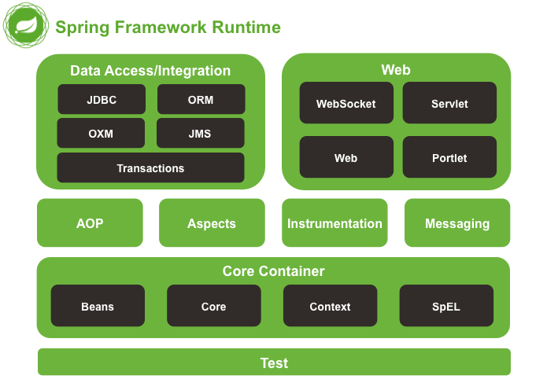

# Spring概览

Spring是一套**轻量级**的Java企业级应用开发框架。

Spring根本目的是降低Java开发的复杂性，使得应用的开发变得“简单”。

Spring发展到现在已经贡献了很多个开源项目，像Spring Boot、Spring Cloud、Spring Security等，而这些项目的基石，也是我们日常项目中接触到的Spring，指的是Spring框架（Spring Framework）项目。

[Spring框架](https://spring.io/projects/spring-framework)包含了（官网5.3.14分类）：

- **[核心技术](https://docs.spring.io/spring-framework/docs/current/spring-framework-reference/core.html)**：DI、资源、Validation、SpEL表达式、AOP等。
- **[测试](https://docs.spring.io/spring-framework/docs/current/spring-framework-reference/testing.html)**：像JUnit的测试框架，包括mock对象、测试上下文等。
- **[数据访问](https://docs.spring.io/spring-framework/docs/current/spring-framework-reference/data-access.html)**：Spring事务、DAO、JDBC、ORM等。
- **WEB框架**：[**Spring MVC**](https://docs.spring.io/spring/docs/current/spring-framework-reference/web.html)与[**Spring WebFlux**](https://docs.spring.io/spring/docs/current/spring-framework-reference/web-reactive.html)。
- **[系列整合](https://docs.spring.io/spring-framework/docs/current/spring-framework-reference/integration.html)**：乱七八糟技术整合，比如RMI、JMS、邮件支持、任务、定时调度、缓存等。
- **[语言支持](https://docs.spring.io/spring-framework/docs/current/spring-framework-reference/languages.html)**：Kotlin、Groovy和动态语言支持。

在Spring 4的年代，他们的官网上还能看到这张图：

上面说Spring的系列项目的基石是Spring框架项目，那么Spring框架的基石便是它的核心容器，也叫IoC容器。IoC（Inversion of Control）控制反转是Spring的核心理念，其还有个别名叫DI（Dependency
Injection）依赖注入。

